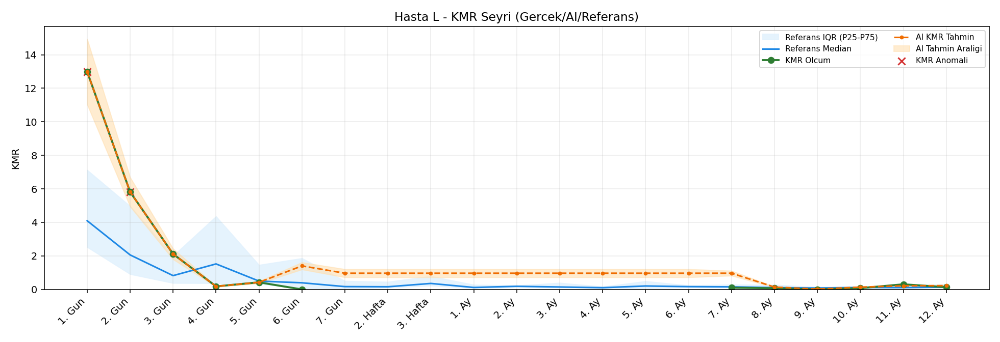
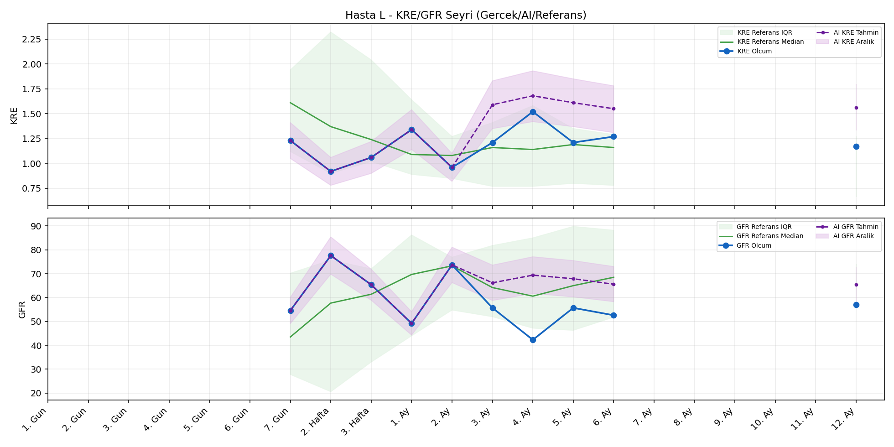
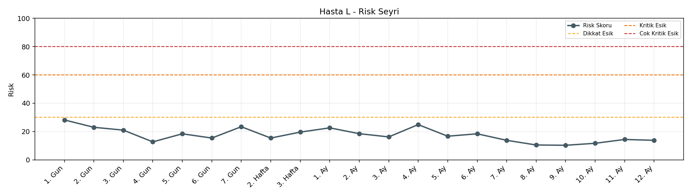

# Hasta L

[Ana rapora don](../../Hasta_Raporları_Detay.md)

## Hasta Ozeti

| Alan | Deger |
|---|---|
| Yas | 41 |
| Cinsiyet | FEMALE |
| BMI | 20.6 |
| Vital Status | LIVING |
| Risk Skoru (Son) | 28.2 |
| Risk Seviyesi | Normal |
| Anomali Durumu | Var |
| Son KMR | 0.1333 (12. Ay) |
| Son KRE | 1.17 (12. Ay) |
| Son GFR | 57.0 (12. Ay) |

## Grafikler

## IQR ve Median Ozeti

| Metrik | Hasta (Median / IQR) | Referans (Median / IQR) | Son Olcum Zamani |
|---|---|---|---|
| KMR | 0.158 / 0.772 | 0.227 / 0.318 | 12. Ay |
| KRE | 1.210 / 0.173 | 1.020 / 0.560 | 12. Ay |
| GFR | 55.700 / 10.200 | 64.000 / 15.000 | 12. Ay |

## AI Performans (Hasta Bazli)

| Metrik | Eval Nokta | MAE | RMSE | MAPE | Aralik Kapsama | Son Hata |
|---|---:|---:|---:|---:|---:|---:|
| KMR | 7 | 0.3714 | 0.6257 | %565.89 | %0.0 | 0.0930 |
| KRE | 5 | 0.160 | 0.169 | %12.96 | %80.0 | 0.210 |
| GFR | 5 | 63.06 | 63.94 | %123.39 | %0.0 | 53.30 |

## Zaman Serisi Detay Tablosu

| Zaman | KMR | AI KMR | Durum | KRE | AI KRE | Durum | GFR | AI GFR | Durum | Risk | Seviye | Anomali |
|---|---:|---:|---|---:|---:|---|---:|---:|---|---:|---|---|
| 1. Gun | 12.9836 | 12.9836 | Olcum Kopyasi | - | - | Uygulanmaz | - | - | Uygulanmaz | 28.2 | Normal | KMR |
| 2. Gun | 5.8155 | 5.8155 | Olcum Kopyasi | - | - | Uygulanmaz | - | - | Uygulanmaz | 23.0 | Normal | KMR |
| 3. Gun | 2.1138 | 2.1138 | Olcum Kopyasi | - | - | Uygulanmaz | - | - | Uygulanmaz | 21.0 | Normal | - |
| 4. Gun | 0.1829 | 0.1829 | Olcum Kopyasi | - | - | Uygulanmaz | - | - | Uygulanmaz | 12.7 | Normal | - |
| 5. Gun | 0.4246 | 0.4246 | Olcum Kopyasi | - | - | Uygulanmaz | - | - | Uygulanmaz | 18.4 | Normal | - |
| 6. Gun | 0.0000 | 1.4034 | Model | - | - | Uygulanmaz | - | - | Uygulanmaz | 15.4 | Normal | - |
| 7. Gun | - | 0.9666 | Ongoru | 1.23 | 1.23 | Olcum Kopyasi | 54.6 | 54.6 | Olcum Kopyasi | 23.4 | Normal | - |
| 2. Hafta | - | 0.9666 | Ongoru | 0.92 | 0.92 | Olcum Kopyasi | 77.6 | 77.6 | Olcum Kopyasi | 15.4 | Normal | - |
| 3. Hafta | - | 0.9666 | Ongoru | 1.06 | 1.06 | Olcum Kopyasi | 65.4 | 65.4 | Olcum Kopyasi | 19.6 | Normal | - |
| 1. Ay | - | 0.9666 | Ongoru | 1.34 | 1.34 | Olcum Kopyasi | 49.2 | 49.2 | Olcum Kopyasi | 22.6 | Normal | - |
| 2. Ay | - | 0.9666 | Ongoru | 0.96 | 0.96 | Olcum Kopyasi | 73.7 | 73.7 | Olcum Kopyasi | 18.5 | Normal | - |
| 3. Ay | - | 0.9666 | Ongoru | 1.21 | 1.41 | Model | 55.7 | 117.2 | Model | 16.2 | Normal | - |
| 4. Ay | - | 0.9666 | Ongoru | 1.52 | 1.43 | Model | 42.3 | 125.3 | Model | 24.9 | Normal | - |
| 5. Ay | - | 0.9666 | Ongoru | 1.21 | 1.41 | Model | 55.7 | 118.0 | Model | 16.7 | Normal | - |
| 6. Ay | - | 0.9666 | Ongoru | 1.27 | 1.37 | Model | 52.6 | 107.8 | Model | 18.4 | Normal | - |
| 7. Ay | 0.1031 | 0.9666 | Model | - | - | Uygulanmaz | - | - | Uygulanmaz | 13.8 | Normal | - |
| 8. Ay | 0.0708 | 0.1404 | Model | - | - | Uygulanmaz | - | - | Uygulanmaz | 10.5 | Normal | - |
| 9. Ay | 0.0000 | 0.0200 | Model | - | - | Uygulanmaz | - | - | Uygulanmaz | 10.3 | Normal | - |
| 10. Ay | 0.0764 | 0.1373 | Model | - | - | Uygulanmaz | - | - | Uygulanmaz | 11.7 | Normal | - |
| 11. Ay | 0.3067 | 0.2174 | Model | - | - | Uygulanmaz | - | - | Uygulanmaz | 14.4 | Normal | - |
| 12. Ay | 0.1333 | 0.2263 | Model | 1.17 | 1.38 | Model | 57.0 | 110.3 | Model | 13.8 | Normal | - |

> Not: Bu dosya `python3 backend/run_all.py` ile otomatik uretilir.
