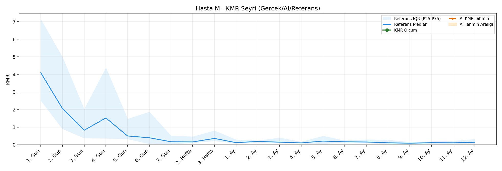
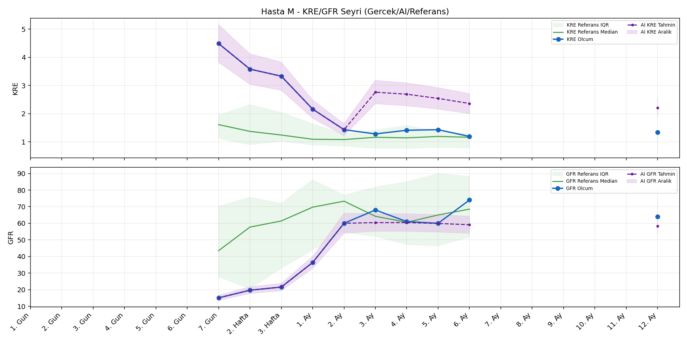
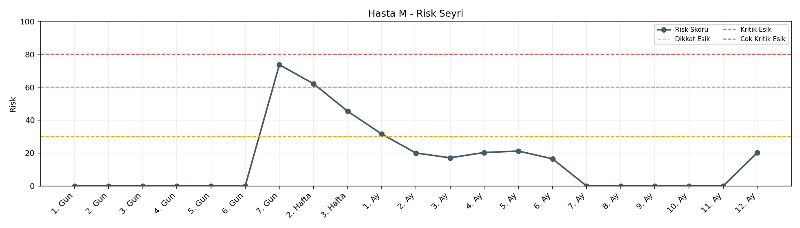

# Hasta M

[Ana rapora don](../../Hasta_Raporları_Detay.md)

## Hasta Ozeti

| Alan | Deger |
|---|---|
| Yas | 42 |
| Cinsiyet | MALE |
| BMI | 31.8 |
| Vital Status | LIVING |
| Risk Skoru (Son) | 73.6 |
| Risk Seviyesi | Kritik |
| Anomali Durumu | Yok |
| Son KMR | - (-) |
| Son KRE | 1.34 (12. Ay) |
| Son GFR | 64.0 (12. Ay) |

## Grafikler

## IQR ve Median Ozeti

| Metrik | Hasta (Median / IQR) | Referans (Median / IQR) | Son Olcum Zamani |
|---|---|---|---|
| KMR | - / - | - / - | - |
| KRE | 1.430 / 1.680 | 1.020 / 0.560 | 12. Ay |
| GFR | 60.000 / 37.950 | 64.000 / 15.000 | 12. Ay |

## AI Performans (Hasta Bazli)

| Metrik | Eval Nokta | MAE | RMSE | MAPE | Aralik Kapsama | Son Hata |
|---|---:|---:|---:|---:|---:|---:|
| KMR | 0 | - | - | - | %0.0 | - |
| KRE | 5 | 1.346 | 1.359 | %101.93 | %0.0 | 1.020 |
| GFR | 5 | 22.18 | 23.88 | %34.99 | %20.0 | -23.90 |

## Zaman Serisi Detay Tablosu

| Zaman | KMR | AI KMR | Durum | KRE | AI KRE | Durum | GFR | AI GFR | Durum | Risk | Seviye | Anomali |
|---|---:|---:|---|---:|---:|---|---:|---:|---|---:|---|---|
| 1. Gun | - | - | Yetersiz Veri | - | - | Uygulanmaz | - | - | Uygulanmaz | 0.0 | Normal | - |
| 2. Gun | - | - | Yetersiz Veri | - | - | Uygulanmaz | - | - | Uygulanmaz | 0.0 | Normal | - |
| 3. Gun | - | - | Yetersiz Veri | - | - | Uygulanmaz | - | - | Uygulanmaz | 0.0 | Normal | - |
| 4. Gun | - | - | Yetersiz Veri | - | - | Uygulanmaz | - | - | Uygulanmaz | 0.0 | Normal | - |
| 5. Gun | - | - | Yetersiz Veri | - | - | Uygulanmaz | - | - | Uygulanmaz | 0.0 | Normal | - |
| 6. Gun | - | - | Yetersiz Veri | - | - | Uygulanmaz | - | - | Uygulanmaz | 0.0 | Normal | - |
| 7. Gun | - | - | Yetersiz Veri | 4.49 | 4.49 | Olcum Kopyasi | 15.1 | 15.1 | Olcum Kopyasi | 73.6 | Kritik | - |
| 2. Hafta | - | - | Yetersiz Veri | 3.58 | 3.58 | Olcum Kopyasi | 19.7 | 19.7 | Olcum Kopyasi | 62.1 | Kritik | - |
| 3. Hafta | - | - | Yetersiz Veri | 3.33 | 3.33 | Olcum Kopyasi | 21.6 | 21.6 | Olcum Kopyasi | 45.4 | Dikkat | - |
| 1. Ay | - | - | Yetersiz Veri | 2.16 | 2.16 | Olcum Kopyasi | 36.4 | 36.4 | Olcum Kopyasi | 31.5 | Dikkat | - |
| 2. Ay | - | - | Yetersiz Veri | 1.43 | 1.43 | Olcum Kopyasi | 60.0 | 60.0 | Olcum Kopyasi | 20.0 | Normal | - |
| 3. Ay | - | - | Yetersiz Veri | 1.28 | 2.86 | Model | 68.0 | 92.3 | Model | 17.1 | Normal | - |
| 4. Ay | - | - | Yetersiz Veri | 1.41 | 2.83 | Model | 61.0 | 93.1 | Model | 20.3 | Normal | - |
| 5. Ay | - | - | Yetersiz Veri | 1.43 | 2.73 | Model | 60.0 | 85.1 | Model | 21.2 | Normal | - |
| 6. Ay | - | - | Yetersiz Veri | 1.19 | 2.60 | Model | 74.0 | 68.5 | Model | 16.5 | Normal | - |
| 7. Ay | - | - | Yetersiz Veri | - | - | Uygulanmaz | - | - | Uygulanmaz | 0.0 | Normal | - |
| 8. Ay | - | - | Yetersiz Veri | - | - | Uygulanmaz | - | - | Uygulanmaz | 0.0 | Normal | - |
| 9. Ay | - | - | Yetersiz Veri | - | - | Uygulanmaz | - | - | Uygulanmaz | 0.0 | Normal | - |
| 10. Ay | - | - | Yetersiz Veri | - | - | Uygulanmaz | - | - | Uygulanmaz | 0.0 | Normal | - |
| 11. Ay | - | - | Yetersiz Veri | - | - | Uygulanmaz | - | - | Uygulanmaz | 0.0 | Normal | - |
| 12. Ay | - | - | Yetersiz Veri | 1.34 | 2.36 | Model | 64.0 | 40.1 | Model | 20.2 | Normal | - |

> Not: Bu dosya `python3 backend/run_all.py` ile otomatik uretilir.
