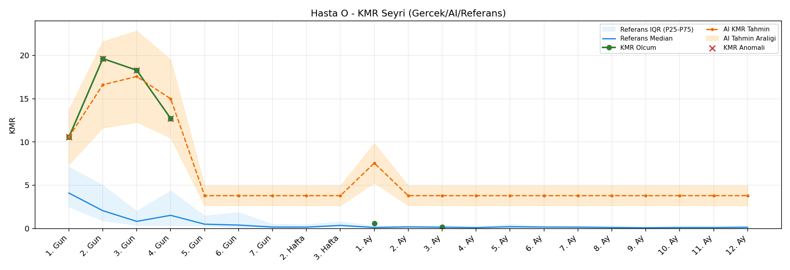
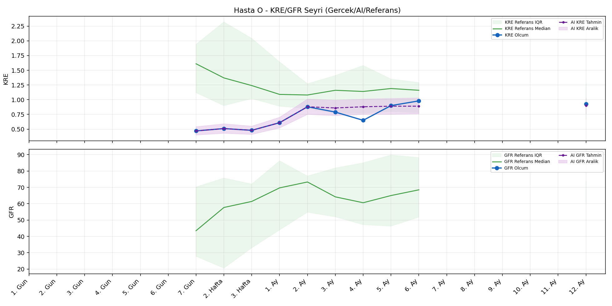
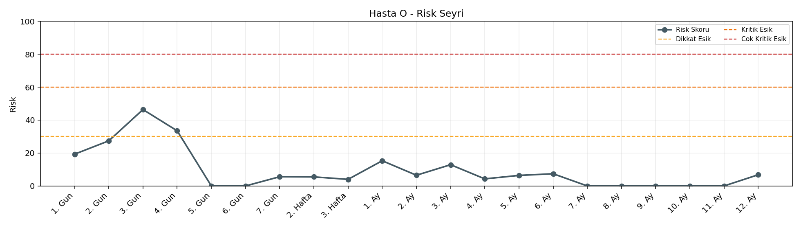

# Hasta O

[Ana rapora don](../../Hasta_Raporları_Detay.md)

## Hasta Ozeti

| Alan | Deger |
|---|---|
| Yas | 12 |
| Cinsiyet | MALE |
| BMI | 16.2 |
| Vital Status | LIVING |
| Risk Skoru (Son) | 46.4 |
| Risk Seviyesi | Dikkat |
| Anomali Durumu | Var |
| Son KMR | 0.1525 (3. Ay) |
| Son KRE | 0.93 (12. Ay) |
| Son GFR | - (-) |

## Grafikler

## IQR ve Median Ozeti

| Metrik | Hasta (Median / IQR) | Referans (Median / IQR) | Son Olcum Zamani |
|---|---|---|---|
| KMR | 11.631 / 13.809 | 0.446 / 0.307 | 3. Ay |
| KRE | 0.720 / 0.360 | 1.020 / 0.560 | 12. Ay |
| GFR | - / - | - / - | - |

## AI Performans (Hasta Bazli)

| Metrik | Eval Nokta | MAE | RMSE | MAPE | Aralik Kapsama | Son Hata |
|---|---:|---:|---:|---:|---:|---:|
| KMR | 0 | - | - | - | %0.0 | - |
| KRE | 5 | 0.122 | 0.144 | %15.68 | %80.0 | -0.120 |
| GFR | 0 | - | - | - | %0.0 | - |

## Zaman Serisi Detay Tablosu

| Zaman | KMR | AI KMR | Durum | KRE | AI KRE | Durum | GFR | AI GFR | Durum | Risk | Seviye | Anomali |
|---|---:|---:|---|---:|---:|---|---:|---:|---|---:|---|---|
| 1. Gun | 10.5478 | 10.5478 | EWMA Yedek | - | - | Uygulanmaz | - | - | Uygulanmaz | 19.3 | Normal | KMR |
| 2. Gun | 19.6306 | 16.6030 | EWMA Yedek | - | - | Uygulanmaz | - | - | Uygulanmaz | 27.4 | Normal | KMR |
| 3. Gun | 18.2856 | 17.5645 | EWMA Yedek | - | - | Uygulanmaz | - | - | Uygulanmaz | 46.4 | Dikkat | KMR |
| 4. Gun | 12.7149 | 14.9780 | EWMA Yedek | - | - | Uygulanmaz | - | - | Uygulanmaz | 33.5 | Dikkat | KMR |
| 5. Gun | - | 3.7950 | Yedek Ongoru | - | - | Uygulanmaz | - | - | Uygulanmaz | 0.0 | Normal | - |
| 6. Gun | - | 3.7950 | Yedek Ongoru | - | - | Uygulanmaz | - | - | Uygulanmaz | 0.0 | Normal | - |
| 7. Gun | - | 3.7950 | Yedek Ongoru | 0.47 | 0.47 | Olcum Kopyasi | - | - | Yetersiz Veri | 5.6 | Normal | - |
| 2. Hafta | - | 3.7950 | Yedek Ongoru | 0.51 | 0.51 | Olcum Kopyasi | - | - | Yetersiz Veri | 5.5 | Normal | - |
| 3. Hafta | - | 3.7950 | Yedek Ongoru | 0.48 | 0.48 | Olcum Kopyasi | - | - | Yetersiz Veri | 4.0 | Normal | - |
| 1. Ay | 0.5960 | 7.5550 | EWMA Yedek | 0.61 | 0.61 | Olcum Kopyasi | - | - | Yetersiz Veri | 15.3 | Normal | - |
| 2. Ay | - | 3.7950 | Yedek Ongoru | 0.88 | 0.88 | Olcum Kopyasi | - | - | Yetersiz Veri | 6.5 | Normal | - |
| 3. Ay | 0.1525 | 3.7950 | EWMA Yedek | 0.79 | 0.89 | Model | - | - | Yetersiz Veri | 12.9 | Normal | - |
| 4. Ay | - | 3.7950 | Yedek Ongoru | 0.65 | 0.90 | Model | - | - | Yetersiz Veri | 4.3 | Normal | - |
| 5. Ay | - | 3.7950 | Yedek Ongoru | 0.90 | 0.89 | Model | - | - | Yetersiz Veri | 6.4 | Normal | - |
| 6. Ay | - | 3.7950 | Yedek Ongoru | 0.98 | 0.85 | Model | - | - | Yetersiz Veri | 7.4 | Normal | - |
| 7. Ay | - | 3.7950 | Yedek Ongoru | - | - | Uygulanmaz | - | - | Uygulanmaz | 0.0 | Normal | - |
| 8. Ay | - | 3.7950 | Yedek Ongoru | - | - | Uygulanmaz | - | - | Uygulanmaz | 0.0 | Normal | - |
| 9. Ay | - | 3.7950 | Yedek Ongoru | - | - | Uygulanmaz | - | - | Uygulanmaz | 0.0 | Normal | - |
| 10. Ay | - | 3.7950 | Yedek Ongoru | - | - | Uygulanmaz | - | - | Uygulanmaz | 0.0 | Normal | - |
| 11. Ay | - | 3.7950 | Yedek Ongoru | - | - | Uygulanmaz | - | - | Uygulanmaz | 0.0 | Normal | - |
| 12. Ay | - | 3.7950 | Yedek Ongoru | 0.93 | 0.81 | Model | - | - | Yetersiz Veri | 6.8 | Normal | - |

> Not: Bu dosya `python3 backend/run_all.py` ile otomatik uretilir.
