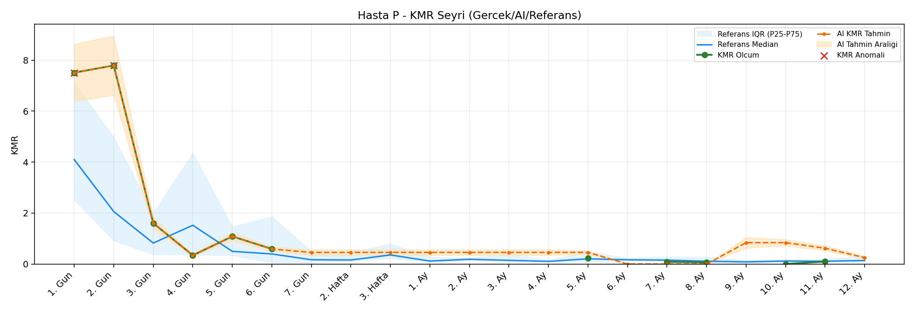
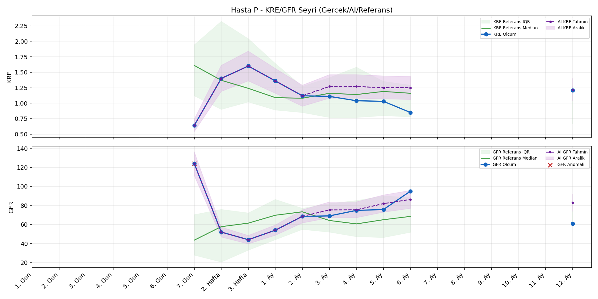
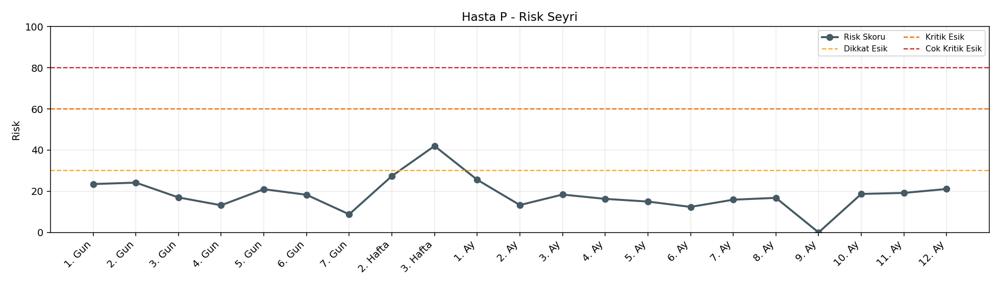

# Hasta P

[Ana rapora don](../../Hasta_Raporları_Detay.md)

## Hasta Ozeti

| Alan | Deger |
|---|---|
| Yas | 25 |
| Cinsiyet | FEMALE |
| BMI | 18.8 |
| Vital Status | LIVING |
| Risk Skoru (Son) | 42.0 |
| Risk Seviyesi | Dikkat |
| Anomali Durumu | Var |
| Son KMR | 0.0997 (11. Ay) |
| Son KRE | 1.21 (12. Ay) |
| Son GFR | 61.0 (12. Ay) |

## Grafikler

## IQR ve Median Ozeti

| Metrik | Hasta (Median / IQR) | Referans (Median / IQR) | Son Olcum Zamani |
|---|---|---|---|
| KMR | 0.343 / 1.249 | 0.110 / 0.139 | 11. Ay |
| KRE | 1.115 / 0.290 | 1.050 / 0.610 | 12. Ay |
| GFR | 68.750 / 19.725 | 64.000 / 13.500 | 12. Ay |

## AI Performans (Hasta Bazli)

| Metrik | Eval Nokta | MAE | RMSE | MAPE | Aralik Kapsama | Son Hata |
|---|---:|---:|---:|---:|---:|---:|
| KMR | 6 | 0.2909 | 0.4161 | %416.63 | %16.7 | 0.5197 |
| KRE | 5 | 0.204 | 0.240 | %21.15 | %40.0 | 0.010 |
| GFR | 5 | 8.74 | 11.26 | %12.64 | %80.0 | 21.90 |

## Zaman Serisi Detay Tablosu

| Zaman | KMR | AI KMR | Durum | KRE | AI KRE | Durum | GFR | AI GFR | Durum | Risk | Seviye | Anomali |
|---|---:|---:|---|---:|---:|---|---:|---:|---|---:|---|---|
| 1. Gun | 7.5083 | 7.5083 | Olcum Kopyasi | - | - | Uygulanmaz | - | - | Uygulanmaz | 23.5 | Normal | KMR |
| 2. Gun | 7.7907 | 7.7907 | Olcum Kopyasi | - | - | Uygulanmaz | - | - | Uygulanmaz | 24.2 | Normal | KMR |
| 3. Gun | 1.6022 | 1.6022 | Olcum Kopyasi | - | - | Uygulanmaz | - | - | Uygulanmaz | 17.0 | Normal | - |
| 4. Gun | 0.3428 | 0.3428 | Olcum Kopyasi | - | - | Uygulanmaz | - | - | Uygulanmaz | 13.2 | Normal | - |
| 5. Gun | 1.0835 | 1.0835 | Olcum Kopyasi | - | - | Uygulanmaz | - | - | Uygulanmaz | 21.0 | Normal | - |
| 6. Gun | 0.5929 | 0.5873 | Model | - | - | Uygulanmaz | - | - | Uygulanmaz | 18.3 | Normal | - |
| 7. Gun | - | 0.4578 | Ongoru | 0.64 | 0.64 | Olcum Kopyasi | 124.0 | 124.0 | Olcum Kopyasi | 8.8 | Normal | GFR |
| 2. Hafta | - | 0.4578 | Ongoru | 1.40 | 1.40 | Olcum Kopyasi | 52.0 | 52.0 | Olcum Kopyasi | 27.4 | Normal | - |
| 3. Hafta | - | 0.4578 | Ongoru | 1.60 | 1.60 | Olcum Kopyasi | 44.0 | 44.0 | Olcum Kopyasi | 42.0 | Dikkat | - |
| 1. Ay | - | 0.4578 | Ongoru | 1.36 | 1.36 | Olcum Kopyasi | 54.0 | 54.0 | Olcum Kopyasi | 25.6 | Normal | - |
| 2. Ay | - | 0.4578 | Ongoru | 1.12 | 1.12 | Olcum Kopyasi | 68.5 | 68.5 | Olcum Kopyasi | 13.3 | Normal | - |
| 3. Ay | - | 0.4578 | Ongoru | 1.11 | 1.27 | Model | 69.0 | 75.3 | Model | 18.4 | Normal | - |
| 4. Ay | - | 0.4578 | Ongoru | 1.04 | 1.27 | Model | 74.8 | 75.4 | Model | 16.3 | Normal | - |
| 5. Ay | 0.2315 | 0.4578 | Model | 1.03 | 1.25 | Model | 75.7 | 81.9 | Model | 15.0 | Normal | - |
| 6. Ay | - | 0.0000 | Ongoru | 0.85 | 1.25 | Model | 95.0 | 86.3 | Model | 12.4 | Normal | - |
| 7. Ay | 0.0878 | 0.0000 | Model | - | - | Uygulanmaz | - | - | Uygulanmaz | 15.9 | Normal | - |
| 8. Ay | 0.0659 | 0.0000 | Model | - | - | Uygulanmaz | - | - | Uygulanmaz | 16.8 | Normal | - |
| 9. Ay | - | 0.8399 | Ongoru | - | - | Uygulanmaz | - | - | Uygulanmaz | 0.0 | Normal | - |
| 10. Ay | 0.0000 | 0.8399 | Model | - | - | Uygulanmaz | - | - | Uygulanmaz | 18.7 | Normal | - |
| 11. Ay | 0.0997 | 0.6194 | Model | - | - | Uygulanmaz | - | - | Uygulanmaz | 19.2 | Normal | - |
| 12. Ay | - | 0.2517 | Ongoru | 1.21 | 1.22 | Model | 61.0 | 82.9 | Model | 21.1 | Normal | - |

> Not: Bu dosya `python3 backend/run_all.py` ile otomatik uretilir.
