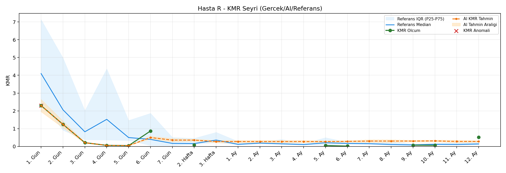
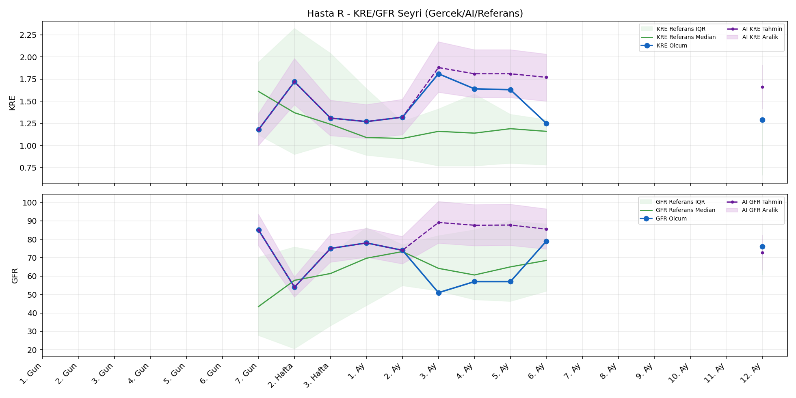
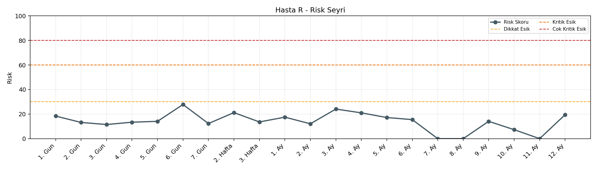

# Hasta R

[Ana rapora don](../../Hasta_Raporları_Detay.md)

## Hasta Ozeti

| Alan | Deger |
|---|---|
| Yas | 25 |
| Cinsiyet | MALE |
| BMI | 21.7 |
| Vital Status | LIVING |
| Risk Skoru (Son) | 26.8 |
| Risk Seviyesi | Normal |
| Anomali Durumu | Yok |
| Son KMR | 0.0177 (6. Ay) |
| Son KRE | 1.29 (12. Ay) |
| Son GFR | 76.0 (12. Ay) |

## Grafikler

## IQR ve Median Ozeti

| Metrik | Hasta (Median / IQR) | Referans (Median / IQR) | Son Olcum Zamani |
|---|---|---|---|
| KMR | 0.076 / 0.820 | 0.142 / 0.866 | 6. Ay |
| KRE | 1.315 / 0.363 | 1.020 / 0.560 | 12. Ay |
| GFR | 74.500 / 20.500 | 64.000 / 15.000 | 12. Ay |

## AI Performans (Hasta Bazli)

| Metrik | Eval Nokta | MAE | RMSE | MAPE | Aralik Kapsama | Son Hata |
|---|---:|---:|---:|---:|---:|---:|
| KMR | 4 | 0.1768 | 0.2013 | %168.63 | %0.0 | 0.0980 |
| KRE | 5 | 0.222 | 0.239 | %14.18 | %60.0 | 0.130 |
| GFR | 5 | 10.26 | 10.46 | %16.74 | %0.0 | -8.60 |

## Zaman Serisi Detay Tablosu

| Zaman | KMR | AI KMR | Durum | KRE | AI KRE | Durum | GFR | AI GFR | Durum | Risk | Seviye | Anomali |
|---|---:|---:|---|---:|---:|---|---:|---:|---|---:|---|---|
| 1. Gun | 2.2974 | 2.2974 | Olcum Kopyasi | - | - | Uygulanmaz | - | - | Uygulanmaz | 17.3 | Normal | - |
| 2. Gun | 1.2402 | 1.2402 | Olcum Kopyasi | - | - | Uygulanmaz | - | - | Uygulanmaz | 12.5 | Normal | - |
| 3. Gun | 0.2100 | 0.2100 | Olcum Kopyasi | - | - | Uygulanmaz | - | - | Uygulanmaz | 11.7 | Normal | - |
| 4. Gun | 0.0592 | 0.0592 | Olcum Kopyasi | - | - | Uygulanmaz | - | - | Uygulanmaz | 13.5 | Normal | - |
| 5. Gun | 0.0447 | 0.0447 | Olcum Kopyasi | - | - | Uygulanmaz | - | - | Uygulanmaz | 14.3 | Normal | - |
| 6. Gun | 0.8673 | 0.5576 | Model | - | - | Uygulanmaz | - | - | Uygulanmaz | 26.8 | Normal | - |
| 7. Gun | - | 0.3026 | Ongoru | 1.18 | 1.18 | Olcum Kopyasi | 85.0 | 85.0 | Olcum Kopyasi | 12.3 | Normal | - |
| 2. Hafta | 0.0763 | 0.3026 | Model | 1.72 | 1.72 | Olcum Kopyasi | 54.0 | 54.0 | Olcum Kopyasi | 20.9 | Normal | - |
| 3. Hafta | - | 0.1200 | Ongoru | 1.31 | 1.31 | Olcum Kopyasi | 75.0 | 75.0 | Olcum Kopyasi | 13.6 | Normal | - |
| 1. Ay | - | 0.1200 | Ongoru | 1.27 | 1.27 | Olcum Kopyasi | 78.0 | 78.0 | Olcum Kopyasi | 17.5 | Normal | - |
| 2. Ay | - | 0.1200 | Ongoru | 1.32 | 1.32 | Olcum Kopyasi | 74.0 | 74.0 | Olcum Kopyasi | 12.1 | Normal | - |
| 3. Ay | - | 0.1200 | Ongoru | 1.81 | 1.42 | Model | 51.0 | 64.9 | Model | 24.1 | Normal | - |
| 4. Ay | - | 0.1200 | Ongoru | 1.64 | 1.42 | Model | 57.0 | 66.2 | Model | 21.0 | Normal | - |
| 5. Ay | 0.0469 | 0.1200 | Model | 1.63 | 1.43 | Model | 57.0 | 65.6 | Model | 16.1 | Normal | - |
| 6. Ay | 0.0177 | 0.1157 | Model | 1.25 | 1.42 | Model | 79.0 | 68.0 | Model | 14.1 | Normal | - |
| 7. Ay | - | 0.1102 | Ongoru | - | - | Uygulanmaz | - | - | Uygulanmaz | 0.0 | Normal | - |
| 8. Ay | - | 0.1102 | Ongoru | - | - | Uygulanmaz | - | - | Uygulanmaz | 0.0 | Normal | - |
| 9. Ay | - | 0.1102 | Ongoru | - | - | Uygulanmaz | - | - | Uygulanmaz | 0.0 | Normal | - |
| 10. Ay | - | 0.1102 | Ongoru | - | - | Uygulanmaz | - | - | Uygulanmaz | 0.0 | Normal | - |
| 11. Ay | - | 0.1102 | Ongoru | - | - | Uygulanmaz | - | - | Uygulanmaz | 0.0 | Normal | - |
| 12. Ay | - | 0.1102 | Ongoru | 1.29 | 1.42 | Model | 76.0 | 67.4 | Model | 11.1 | Normal | - |

> Not: Bu dosya `python3 backend/run_all.py` ile otomatik uretilir.
