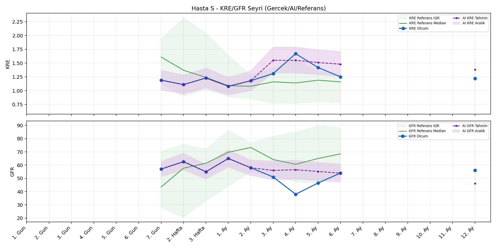
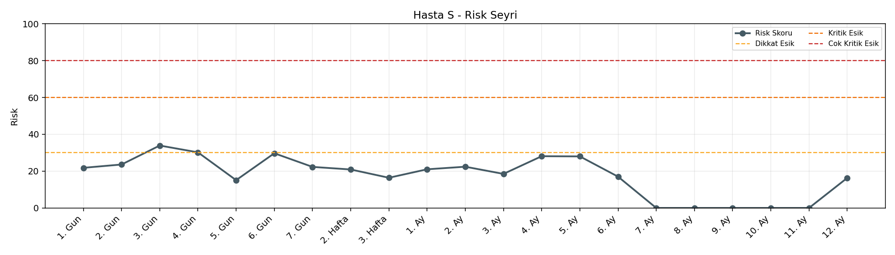

# Hasta S

[Ana rapora don](../../Hasta_Raporları_Detay.md)

## Hasta Ozeti

| Alan | Deger |
|---|---|
| Yas | 39 |
| Cinsiyet | FEMALE |
| BMI | 18.5 |
| Vital Status | LIVING |
| Risk Skoru (Son) | 33.9 |
| Risk Seviyesi | Dikkat |
| Anomali Durumu | Var |
| Son KMR | 2.6796 (5. Ay) |
| Son KRE | 1.22 (12. Ay) |
| Son GFR | 56.0 (12. Ay) |

## Grafikler

## IQR ve Median Ozeti

| Metrik | Hasta (Median / IQR) | Referans (Median / IQR) | Son Olcum Zamani |
|---|---|---|---|
| KMR | 9.046 / 10.330 | 0.490 / 0.789 | 5. Ay |
| KRE | 1.225 / 0.113 | 1.020 / 0.560 | 12. Ay |
| GFR | 55.500 / 6.000 | 64.000 / 15.000 | 12. Ay |

## AI Performans (Hasta Bazli)

| Metrik | Eval Nokta | MAE | RMSE | MAPE | Aralik Kapsama | Son Hata |
|---|---:|---:|---:|---:|---:|---:|
| KMR | 2 | 1.7227 | 1.7837 | %61.21 | %0.0 | 2.1852 |
| KRE | 5 | 0.130 | 0.187 | %8.58 | %80.0 | 0.060 |
| GFR | 5 | 5.86 | 7.43 | %13.08 | %60.0 | -8.30 |

## Zaman Serisi Detay Tablosu

| Zaman | KMR | AI KMR | Durum | KRE | AI KRE | Durum | GFR | AI GFR | Durum | Risk | Seviye | Anomali |
|---|---:|---:|---|---:|---:|---|---:|---:|---|---:|---|---|
| 1. Gun | 12.7713 | 12.7713 | Olcum Kopyasi | - | - | Uygulanmaz | - | - | Uygulanmaz | 21.8 | Normal | KMR |
| 2. Gun | 14.7491 | 14.7491 | Olcum Kopyasi | - | - | Uygulanmaz | - | - | Uygulanmaz | 23.6 | Normal | KMR |
| 3. Gun | 13.6520 | 13.6520 | Olcum Kopyasi | - | - | Uygulanmaz | - | - | Uygulanmaz | 33.9 | Dikkat | KMR |
| 4. Gun | 9.0457 | 9.0457 | Olcum Kopyasi | - | - | Uygulanmaz | - | - | Uygulanmaz | 30.2 | Dikkat | KMR |
| 5. Gun | 0.5496 | 0.5496 | Olcum Kopyasi | - | - | Uygulanmaz | - | - | Uygulanmaz | 15.1 | Normal | - |
| 6. Gun | 3.0841 | 4.3443 | Model | - | - | Uygulanmaz | - | - | Uygulanmaz | 30.2 | Dikkat | - |
| 7. Gun | - | 4.8648 | Ongoru | 1.19 | 1.19 | Olcum Kopyasi | 57.0 | 57.0 | Olcum Kopyasi | 22.3 | Normal | - |
| 2. Hafta | - | 4.8648 | Ongoru | 1.11 | 1.11 | Olcum Kopyasi | 62.6 | 62.6 | Olcum Kopyasi | 20.9 | Normal | - |
| 3. Hafta | - | 4.8648 | Ongoru | 1.23 | 1.23 | Olcum Kopyasi | 55.0 | 55.0 | Olcum Kopyasi | 16.4 | Normal | - |
| 1. Ay | - | 4.8648 | Ongoru | 1.08 | 1.08 | Olcum Kopyasi | 65.0 | 65.0 | Olcum Kopyasi | 21.0 | Normal | - |
| 2. Ay | - | 4.8648 | Ongoru | 1.18 | 1.18 | Olcum Kopyasi | 58.0 | 58.0 | Olcum Kopyasi | 22.4 | Normal | - |
| 3. Ay | - | 4.8648 | Ongoru | 1.31 | 1.28 | Model | 51.0 | 51.0 | Model | 18.5 | Normal | - |
| 4. Ay | - | 4.8648 | Ongoru | 1.67 | 1.28 | Model | 38.0 | 51.3 | Model | 28.1 | Normal | - |
| 5. Ay | 2.6796 | 4.8648 | Model | 1.42 | 1.29 | Model | 46.5 | 51.0 | Model | 29.3 | Normal | - |
| 6. Ay | - | 5.6155 | Ongoru | 1.25 | 1.29 | Model | 54.0 | 50.8 | Model | 17.0 | Normal | - |
| 7. Ay | - | 5.6155 | Ongoru | - | - | Uygulanmaz | - | - | Uygulanmaz | 0.0 | Normal | - |
| 8. Ay | - | 5.6155 | Ongoru | - | - | Uygulanmaz | - | - | Uygulanmaz | 0.0 | Normal | - |
| 9. Ay | - | 5.6155 | Ongoru | - | - | Uygulanmaz | - | - | Uygulanmaz | 0.0 | Normal | - |
| 10. Ay | - | 5.6155 | Ongoru | - | - | Uygulanmaz | - | - | Uygulanmaz | 0.0 | Normal | - |
| 11. Ay | - | 5.6155 | Ongoru | - | - | Uygulanmaz | - | - | Uygulanmaz | 0.0 | Normal | - |
| 12. Ay | - | 5.6155 | Ongoru | 1.22 | 1.28 | Model | 56.0 | 47.7 | Model | 16.3 | Normal | - |

> Not: Bu dosya `python3 backend/run_all.py` ile otomatik uretilir.
