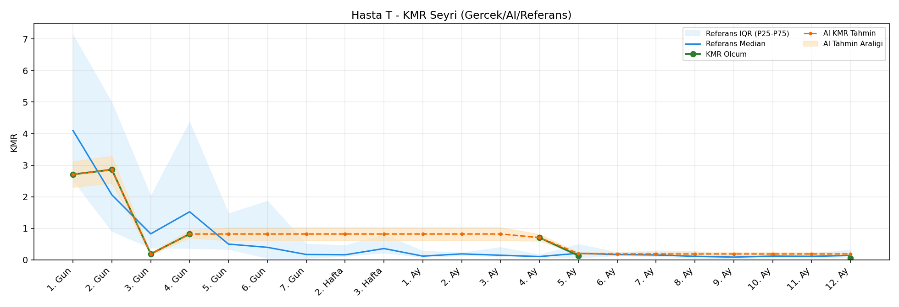
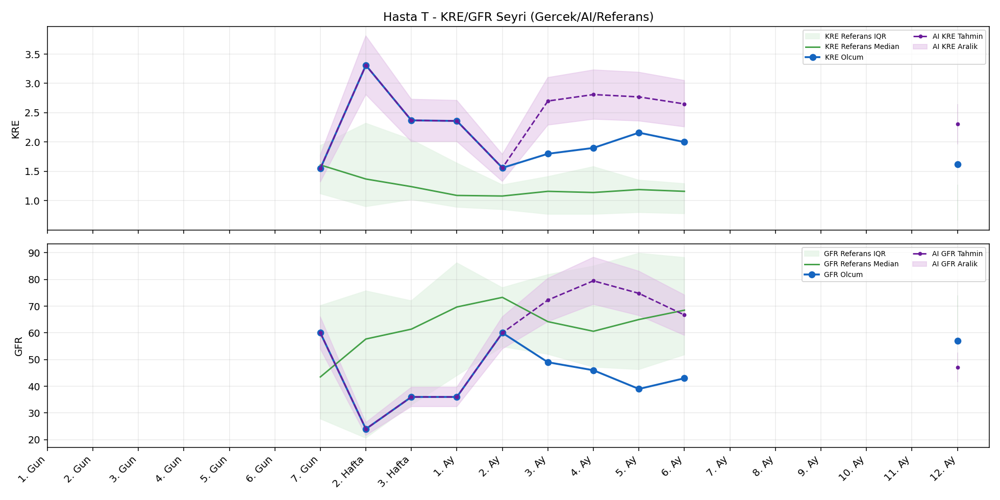
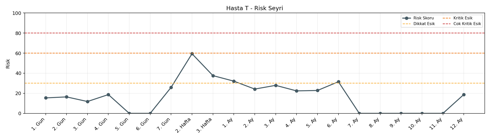

# Hasta T

[Ana rapora don](../../Hasta_Raporları_Detay.md)

## Hasta Ozeti

| Alan | Deger |
|---|---|
| Yas | 28 |
| Cinsiyet | MALE |
| BMI | 24.4 |
| Vital Status | LIVING |
| Risk Skoru (Son) | 59.4 |
| Risk Seviyesi | Dikkat |
| Anomali Durumu | Yok |
| Son KMR | 0.1331 (5. Ay) |
| Son KRE | 1.62 (12. Ay) |
| Son GFR | 57.0 (12. Ay) |

## Grafikler

## IQR ve Median Ozeti

| Metrik | Hasta (Median / IQR) | Referans (Median / IQR) | Son Olcum Zamani |
|---|---|---|---|
| KMR | 0.761 / 1.921 | 0.490 / 0.789 | 5. Ay |
| KRE | 1.950 / 0.645 | 1.020 / 0.560 | 12. Ay |
| GFR | 44.500 / 18.250 | 64.000 / 15.000 | 12. Ay |

## AI Performans (Hasta Bazli)

| Metrik | Eval Nokta | MAE | RMSE | MAPE | Aralik Kapsama | Son Hata |
|---|---:|---:|---:|---:|---:|---:|
| KMR | 0 | - | - | - | %0.0 | - |
| KRE | 5 | 0.268 | 0.325 | %15.22 | %80.0 | 0.590 |
| GFR | 5 | 34.82 | 36.45 | %76.52 | %0.0 | -27.10 |

## Zaman Serisi Detay Tablosu

| Zaman | KMR | AI KMR | Durum | KRE | AI KRE | Durum | GFR | AI GFR | Durum | Risk | Seviye | Anomali |
|---|---:|---:|---|---:|---:|---|---:|---:|---|---:|---|---|
| 1. Gun | 2.7086 | 2.7086 | EWMA Yedek | - | - | Uygulanmaz | - | - | Uygulanmaz | 14.9 | Normal | - |
| 2. Gun | 2.8587 | 2.8087 | EWMA Yedek | - | - | Uygulanmaz | - | - | Uygulanmaz | 16.0 | Normal | - |
| 3. Gun | 0.1860 | 1.3100 | EWMA Yedek | - | - | Uygulanmaz | - | - | Uygulanmaz | 16.6 | Normal | - |
| 4. Gun | 0.8185 | 1.0479 | EWMA Yedek | - | - | Uygulanmaz | - | - | Uygulanmaz | 20.2 | Normal | - |
| 5. Gun | - | 0.4959 | Yedek Ongoru | - | - | Uygulanmaz | - | - | Uygulanmaz | 0.0 | Normal | - |
| 6. Gun | - | 0.4959 | Yedek Ongoru | - | - | Uygulanmaz | - | - | Uygulanmaz | 0.0 | Normal | - |
| 7. Gun | - | 0.4959 | Yedek Ongoru | 1.55 | 1.55 | Olcum Kopyasi | 60.0 | 60.0 | Olcum Kopyasi | 25.9 | Normal | - |
| 2. Hafta | - | 0.4959 | Yedek Ongoru | 3.31 | 3.31 | Olcum Kopyasi | 24.0 | 24.0 | Olcum Kopyasi | 59.4 | Dikkat | - |
| 3. Hafta | - | 0.4959 | Yedek Ongoru | 2.37 | 2.37 | Olcum Kopyasi | 36.0 | 36.0 | Olcum Kopyasi | 37.6 | Dikkat | - |
| 1. Ay | - | 0.4959 | Yedek Ongoru | 2.36 | 2.36 | Olcum Kopyasi | 36.0 | 36.0 | Olcum Kopyasi | 32.1 | Dikkat | - |
| 2. Ay | - | 0.4959 | Yedek Ongoru | 1.56 | 1.56 | Olcum Kopyasi | 60.0 | 60.0 | Olcum Kopyasi | 24.2 | Normal | - |
| 3. Ay | - | 0.4959 | Yedek Ongoru | 1.80 | 2.11 | Model | 49.0 | 86.7 | Model | 27.9 | Normal | - |
| 4. Ay | 0.7042 | 0.8705 | EWMA Yedek | 1.90 | 2.12 | Model | 46.0 | 91.7 | Model | 23.3 | Normal | - |
| 5. Ay | 0.1331 | 0.4959 | EWMA Yedek | 2.16 | 2.13 | Model | 39.0 | 84.5 | Model | 24.2 | Normal | - |
| 6. Ay | - | 0.4959 | Yedek Ongoru | 2.00 | 2.19 | Model | 43.0 | 61.1 | Model | 31.5 | Dikkat | - |
| 7. Ay | - | 0.4959 | Yedek Ongoru | - | - | Uygulanmaz | - | - | Uygulanmaz | 0.0 | Normal | - |
| 8. Ay | - | 0.4959 | Yedek Ongoru | - | - | Uygulanmaz | - | - | Uygulanmaz | 0.0 | Normal | - |
| 9. Ay | - | 0.4959 | Yedek Ongoru | - | - | Uygulanmaz | - | - | Uygulanmaz | 0.0 | Normal | - |
| 10. Ay | - | 0.4959 | Yedek Ongoru | - | - | Uygulanmaz | - | - | Uygulanmaz | 0.0 | Normal | - |
| 11. Ay | - | 0.4959 | Yedek Ongoru | - | - | Uygulanmaz | - | - | Uygulanmaz | 0.0 | Normal | - |
| 12. Ay | - | 0.4959 | Yedek Ongoru | 1.62 | 2.21 | Model | 57.0 | 29.9 | Model | 25.9 | Normal | - |

> Not: Bu dosya `python3 backend/run_all.py` ile otomatik uretilir.
