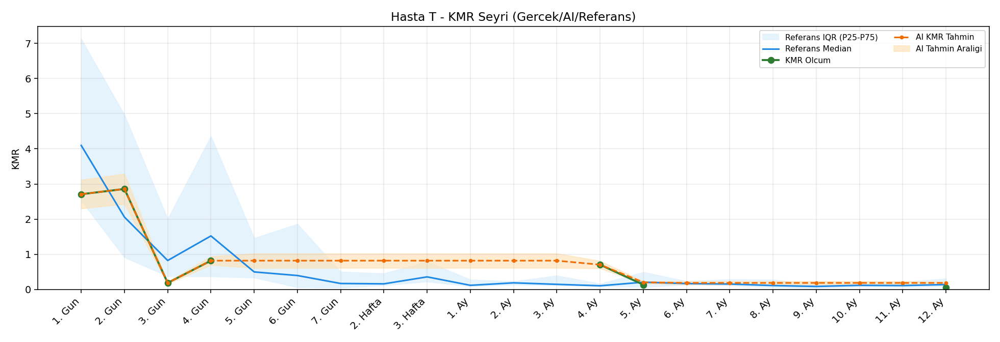
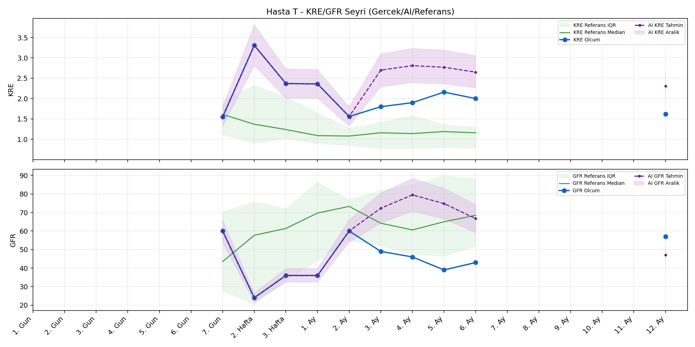
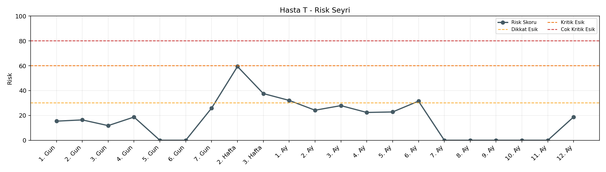

# Hasta T

[Ana rapora don](../../Hasta_Raporları_Detay.md)

## Hasta Ozeti

| Alan | Deger |
|---|---|
| Yas | 28 |
| Cinsiyet | MALE |
| BMI | 24.4 |
| Vital Status | LIVING |
| Risk Skoru (Son) | 59.4 |
| Risk Seviyesi | Dikkat |
| Anomali Durumu | Yok |
| Son KMR | 0.0587 (12. Ay) |
| Son KRE | 1.62 (12. Ay) |
| Son GFR | 57.0 (12. Ay) |

## Grafikler

## IQR ve Median Ozeti

| Metrik | Hasta (Median / IQR) | Referans (Median / IQR) | Son Olcum Zamani |
|---|---|---|---|
| KMR | 0.704 / 1.604 | 0.138 / 0.217 | 12. Ay |
| KRE | 1.950 / 0.645 | 1.050 / 0.610 | 12. Ay |
| GFR | 44.500 / 18.250 | 64.000 / 13.500 | 12. Ay |

## AI Performans (Hasta Bazli)

| Metrik | Eval Nokta | MAE | RMSE | MAPE | Aralik Kapsama | Son Hata |
|---|---:|---:|---:|---:|---:|---:|
| KMR | 2 | 0.0979 | 0.1022 | %134.11 | %0.0 | 0.1271 |
| KRE | 5 | 0.752 | 0.763 | %40.25 | %0.0 | 0.690 |
| GFR | 5 | 25.26 | 26.86 | %56.97 | %0.0 | -10.00 |

## Zaman Serisi Detay Tablosu

| Zaman | KMR | AI KMR | Durum | KRE | AI KRE | Durum | GFR | AI GFR | Durum | Risk | Seviye | Anomali |
|---|---:|---:|---|---:|---:|---|---:|---:|---|---:|---|---|
| 1. Gun | 2.7086 | 2.7086 | Olcum Kopyasi | - | - | Uygulanmaz | - | - | Uygulanmaz | 15.4 | Normal | - |
| 2. Gun | 2.8587 | 2.8587 | Olcum Kopyasi | - | - | Uygulanmaz | - | - | Uygulanmaz | 16.4 | Normal | - |
| 3. Gun | 0.1860 | 0.1860 | Olcum Kopyasi | - | - | Uygulanmaz | - | - | Uygulanmaz | 11.8 | Normal | - |
| 4. Gun | 0.8185 | 0.8185 | Olcum Kopyasi | - | - | Uygulanmaz | - | - | Uygulanmaz | 18.7 | Normal | - |
| 5. Gun | - | 0.8185 | Ongoru | - | - | Uygulanmaz | - | - | Uygulanmaz | 0.0 | Normal | - |
| 6. Gun | - | 0.8185 | Ongoru | - | - | Uygulanmaz | - | - | Uygulanmaz | 0.0 | Normal | - |
| 7. Gun | - | 0.8185 | Ongoru | 1.55 | 1.55 | Olcum Kopyasi | 60.0 | 60.0 | Olcum Kopyasi | 25.9 | Normal | - |
| 2. Hafta | - | 0.8185 | Ongoru | 3.31 | 3.31 | Olcum Kopyasi | 24.0 | 24.0 | Olcum Kopyasi | 59.4 | Dikkat | - |
| 3. Hafta | - | 0.8185 | Ongoru | 2.37 | 2.37 | Olcum Kopyasi | 36.0 | 36.0 | Olcum Kopyasi | 37.6 | Dikkat | - |
| 1. Ay | - | 0.8185 | Ongoru | 2.36 | 2.36 | Olcum Kopyasi | 36.0 | 36.0 | Olcum Kopyasi | 32.1 | Dikkat | - |
| 2. Ay | - | 0.8185 | Ongoru | 1.56 | 1.56 | Olcum Kopyasi | 60.0 | 60.0 | Olcum Kopyasi | 24.2 | Normal | - |
| 3. Ay | - | 0.8185 | Ongoru | 1.80 | 2.70 | Model | 49.0 | 72.3 | Model | 27.9 | Normal | - |
| 4. Ay | 0.7042 | 0.7042 | Olcum Kopyasi | 1.90 | 2.81 | Model | 46.0 | 79.5 | Model | 22.4 | Normal | - |
| 5. Ay | 0.1331 | 0.2019 | Model | 2.16 | 2.77 | Model | 39.0 | 74.8 | Model | 22.8 | Normal | - |
| 6. Ay | - | 0.1858 | Ongoru | 2.00 | 2.65 | Model | 43.0 | 66.7 | Model | 31.5 | Dikkat | - |
| 7. Ay | - | 0.1858 | Ongoru | - | - | Uygulanmaz | - | - | Uygulanmaz | 0.0 | Normal | - |
| 8. Ay | - | 0.1858 | Ongoru | - | - | Uygulanmaz | - | - | Uygulanmaz | 0.0 | Normal | - |
| 9. Ay | - | 0.1858 | Ongoru | - | - | Uygulanmaz | - | - | Uygulanmaz | 0.0 | Normal | - |
| 10. Ay | - | 0.1858 | Ongoru | - | - | Uygulanmaz | - | - | Uygulanmaz | 0.0 | Normal | - |
| 11. Ay | - | 0.1858 | Ongoru | - | - | Uygulanmaz | - | - | Uygulanmaz | 0.0 | Normal | - |
| 12. Ay | 0.0587 | 0.1858 | Model | 1.62 | 2.31 | Model | 57.0 | 47.0 | Model | 18.8 | Normal | - |

> Not: Bu dosya `python3 backend/run_all.py` ile otomatik uretilir.
