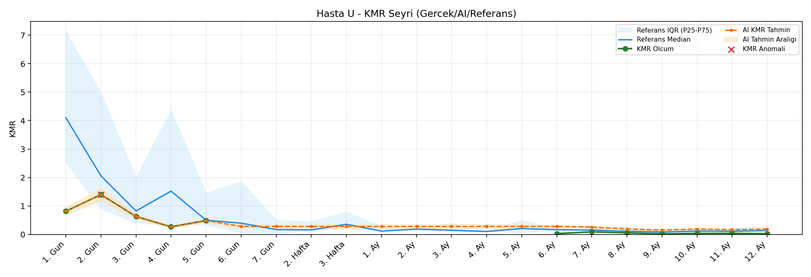
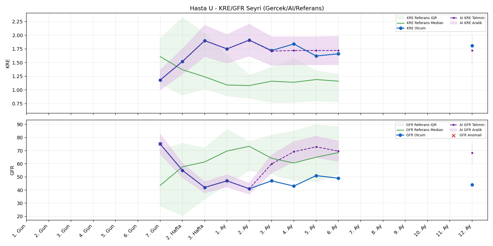
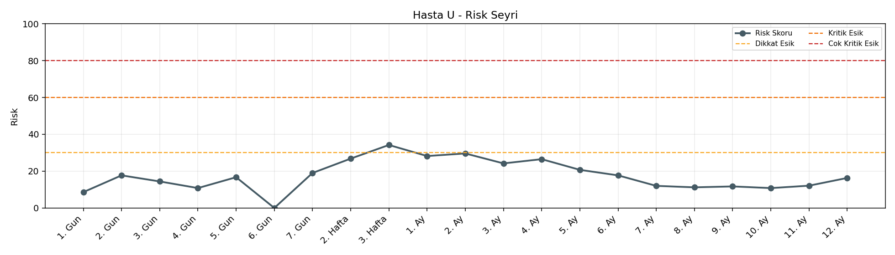

# Hasta U

[Ana rapora don](../../Hasta_Raporları_Detay.md)

## Hasta Ozeti

| Alan | Deger |
|---|---|
| Yas | 43 |
| Cinsiyet | MALE |
| BMI | 28.0 |
| Vital Status | LIVING |
| Risk Skoru (Son) | 34.2 |
| Risk Seviyesi | Dikkat |
| Anomali Durumu | Var |
| Son KMR | 0.0253 (12. Ay) |
| Son KRE | 1.81 (12. Ay) |
| Son GFR | 44.0 (12. Ay) |

## Grafikler

## IQR ve Median Ozeti

| Metrik | Hasta (Median / IQR) | Referans (Median / IQR) | Son Olcum Zamani |
|---|---|---|---|
| KMR | 0.073 / 0.491 | 0.138 / 0.217 | 12. Ay |
| KRE | 1.735 / 0.202 | 1.050 / 0.610 | 12. Ay |
| GFR | 47.000 / 7.250 | 64.000 / 13.500 | 12. Ay |

## AI Performans (Hasta Bazli)

| Metrik | Eval Nokta | MAE | RMSE | MAPE | Aralik Kapsama | Son Hata |
|---|---:|---:|---:|---:|---:|---:|
| KMR | 7 | 0.1626 | 0.1671 | %299.64 | %0.0 | 0.1660 |
| KRE | 5 | 0.076 | 0.085 | %4.37 | %100.0 | -0.090 |
| GFR | 5 | 21.18 | 21.67 | %45.72 | %0.0 | 24.30 |

## Zaman Serisi Detay Tablosu

| Zaman | KMR | AI KMR | Durum | KRE | AI KRE | Durum | GFR | AI GFR | Durum | Risk | Seviye | Anomali |
|---|---:|---:|---|---:|---:|---|---:|---:|---|---:|---|---|
| 1. Gun | 0.8156 | 0.8156 | Olcum Kopyasi | - | - | Uygulanmaz | - | - | Uygulanmaz | 8.6 | Normal | - |
| 2. Gun | 1.3992 | 1.3992 | Olcum Kopyasi | - | - | Uygulanmaz | - | - | Uygulanmaz | 17.7 | Normal | KMR |
| 3. Gun | 0.6304 | 0.6304 | Olcum Kopyasi | - | - | Uygulanmaz | - | - | Uygulanmaz | 14.4 | Normal | - |
| 4. Gun | 0.2667 | 0.2667 | Olcum Kopyasi | - | - | Uygulanmaz | - | - | Uygulanmaz | 10.8 | Normal | - |
| 5. Gun | 0.4875 | 0.4875 | Olcum Kopyasi | - | - | Uygulanmaz | - | - | Uygulanmaz | 16.7 | Normal | - |
| 6. Gun | - | 0.2802 | Ongoru | - | - | Uygulanmaz | - | - | Uygulanmaz | 0.0 | Normal | - |
| 7. Gun | - | 0.2802 | Ongoru | 1.18 | 1.18 | Olcum Kopyasi | 75.1 | 75.1 | Olcum Kopyasi | 19.0 | Normal | GFR |
| 2. Hafta | - | 0.2802 | Ongoru | 1.52 | 1.52 | Olcum Kopyasi | 55.0 | 55.0 | Olcum Kopyasi | 26.8 | Normal | - |
| 3. Hafta | - | 0.2802 | Ongoru | 1.90 | 1.90 | Olcum Kopyasi | 42.0 | 42.0 | Olcum Kopyasi | 34.2 | Dikkat | - |
| 1. Ay | - | 0.2802 | Ongoru | 1.75 | 1.75 | Olcum Kopyasi | 47.0 | 47.0 | Olcum Kopyasi | 28.2 | Normal | - |
| 2. Ay | - | 0.2802 | Ongoru | 1.91 | 1.91 | Olcum Kopyasi | 41.0 | 41.0 | Olcum Kopyasi | 29.6 | Normal | - |
| 3. Ay | - | 0.2802 | Ongoru | 1.72 | 1.71 | Model | 47.0 | 59.9 | Model | 24.2 | Normal | - |
| 4. Ay | - | 0.2802 | Ongoru | 1.84 | 1.72 | Model | 43.0 | 69.2 | Model | 26.5 | Normal | - |
| 5. Ay | - | 0.2802 | Ongoru | 1.62 | 1.72 | Model | 51.0 | 72.9 | Model | 20.7 | Normal | - |
| 6. Ay | 0.0297 | 0.2802 | Model | 1.66 | 1.72 | Model | 49.0 | 69.6 | Model | 17.7 | Normal | - |
| 7. Ay | 0.0900 | 0.2580 | Model | - | - | Uygulanmaz | - | - | Uygulanmaz | 12.0 | Normal | - |
| 8. Ay | 0.0561 | 0.1895 | Model | - | - | Uygulanmaz | - | - | Uygulanmaz | 11.2 | Normal | - |
| 9. Ay | 0.0217 | 0.1535 | Model | - | - | Uygulanmaz | - | - | Uygulanmaz | 11.7 | Normal | - |
| 10. Ay | 0.0334 | 0.1899 | Model | - | - | Uygulanmaz | - | - | Uygulanmaz | 10.8 | Normal | - |
| 11. Ay | 0.0355 | 0.1672 | Model | - | - | Uygulanmaz | - | - | Uygulanmaz | 12.1 | Normal | - |
| 12. Ay | 0.0253 | 0.1913 | Model | 1.81 | 1.72 | Model | 44.0 | 68.3 | Model | 16.3 | Normal | - |

> Not: Bu dosya `python3 backend/run_all.py` ile otomatik uretilir.
