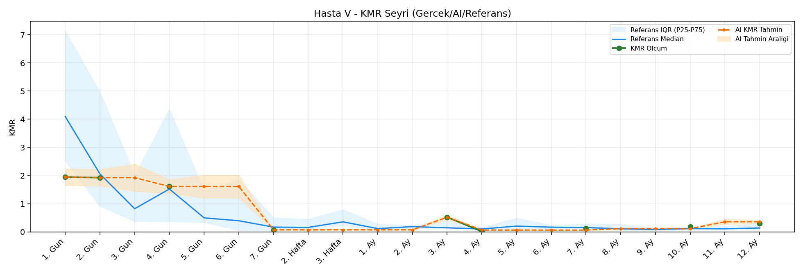
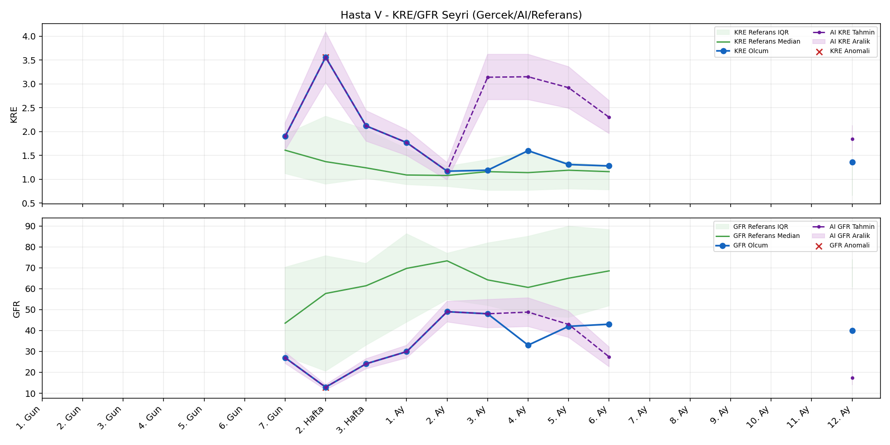
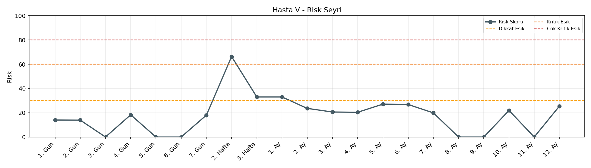

# Hasta V

[Ana rapora don](../../Hasta_Raporları_Detay.md)

## Hasta Ozeti

| Alan | Deger |
|---|---|
| Yas | 64 |
| Cinsiyet | FEMALE |
| BMI | 29.0 |
| Vital Status | LIVING |
| Risk Skoru (Son) | 66.3 |
| Risk Seviyesi | Kritik |
| Anomali Durumu | Var |
| Son KMR | 0.1291 (7. Ay) |
| Son KRE | 1.36 (12. Ay) |
| Son GFR | 40.0 (12. Ay) |

## Grafikler

## IQR ve Median Ozeti

| Metrik | Hasta (Median / IQR) | Referans (Median / IQR) | Son Olcum Zamani |
|---|---|---|---|
| KMR | 0.522 / 1.668 | 0.143 / 0.157 | 7. Ay |
| KRE | 1.480 / 0.580 | 1.020 / 0.560 | 12. Ay |
| GFR | 36.500 / 15.025 | 64.000 / 15.000 | 12. Ay |

## AI Performans (Hasta Bazli)

| Metrik | Eval Nokta | MAE | RMSE | MAPE | Aralik Kapsama | Son Hata |
|---|---:|---:|---:|---:|---:|---:|
| KMR | 2 | 0.6876 | 0.6894 | %984.54 | %0.0 | 0.6376 |
| KRE | 5 | 1.480 | 1.503 | %111.66 | %0.0 | 1.000 |
| GFR | 5 | 47.22 | 51.14 | %118.69 | %0.0 | 13.20 |

## Zaman Serisi Detay Tablosu

| Zaman | KMR | AI KMR | Durum | KRE | AI KRE | Durum | GFR | AI GFR | Durum | Risk | Seviye | Anomali |
|---|---:|---:|---|---:|---:|---|---:|---:|---|---:|---|---|
| 1. Gun | 1.9487 | 1.9487 | Olcum Kopyasi | - | - | Uygulanmaz | - | - | Uygulanmaz | 13.2 | Normal | - |
| 2. Gun | 1.9261 | 1.9261 | Olcum Kopyasi | - | - | Uygulanmaz | - | - | Uygulanmaz | 13.1 | Normal | - |
| 3. Gun | - | 1.9261 | Ongoru | - | - | Uygulanmaz | - | - | Uygulanmaz | 0.0 | Normal | - |
| 4. Gun | 1.6126 | 1.6126 | Olcum Kopyasi | - | - | Uygulanmaz | - | - | Uygulanmaz | 17.6 | Normal | - |
| 5. Gun | - | 1.6126 | Ongoru | - | - | Uygulanmaz | - | - | Uygulanmaz | 0.0 | Normal | - |
| 6. Gun | - | 1.6126 | Ongoru | - | - | Uygulanmaz | - | - | Uygulanmaz | 0.0 | Normal | - |
| 7. Gun | 0.0731 | 0.0731 | Olcum Kopyasi | 1.90 | 1.90 | Olcum Kopyasi | 27.0 | 27.0 | Olcum Kopyasi | 18.3 | Normal | - |
| 2. Hafta | - | 0.0731 | Ongoru | 3.56 | 3.56 | Olcum Kopyasi | 12.9 | 12.9 | Olcum Kopyasi | 66.3 | Kritik | KRE,GFR |
| 3. Hafta | - | 0.0731 | Ongoru | 2.12 | 2.12 | Olcum Kopyasi | 24.1 | 24.1 | Olcum Kopyasi | 33.0 | Dikkat | - |
| 1. Ay | - | 0.0731 | Ongoru | 1.77 | 1.77 | Olcum Kopyasi | 29.9 | 29.9 | Olcum Kopyasi | 33.0 | Dikkat | - |
| 2. Ay | - | 0.0731 | Ongoru | 1.17 | 1.17 | Olcum Kopyasi | 49.0 | 49.0 | Olcum Kopyasi | 23.6 | Normal | - |
| 3. Ay | 0.5222 | 0.5222 | Olcum Kopyasi | 1.19 | 2.97 | Model | 48.0 | 99.3 | Model | 20.9 | Normal | - |
| 4. Ay | 0.0124 | 0.7500 | Model | 1.60 | 3.06 | Model | 33.0 | 106.0 | Model | 23.9 | Normal | - |
| 5. Ay | - | 0.7667 | Ongoru | 1.31 | 2.95 | Model | 42.0 | 97.7 | Model | 27.1 | Normal | - |
| 6. Ay | - | 0.7667 | Ongoru | 1.28 | 2.80 | Model | 43.0 | 85.9 | Model | 26.8 | Normal | - |
| 7. Ay | 0.1291 | 0.7667 | Model | - | - | Uygulanmaz | - | - | Uygulanmaz | 23.3 | Normal | - |
| 8. Ay | - | 0.7633 | Ongoru | - | - | Uygulanmaz | - | - | Uygulanmaz | 0.0 | Normal | - |
| 9. Ay | - | 0.7633 | Ongoru | - | - | Uygulanmaz | - | - | Uygulanmaz | 0.0 | Normal | - |
| 10. Ay | - | 0.7633 | Ongoru | - | - | Uygulanmaz | - | - | Uygulanmaz | 0.0 | Normal | - |
| 11. Ay | - | 0.7633 | Ongoru | - | - | Uygulanmaz | - | - | Uygulanmaz | 0.0 | Normal | - |
| 12. Ay | - | 0.7633 | Ongoru | 1.36 | 2.36 | Model | 40.0 | 53.2 | Model | 28.2 | Normal | - |

> Not: Bu dosya `python3 backend/run_all.py` ile otomatik uretilir.
