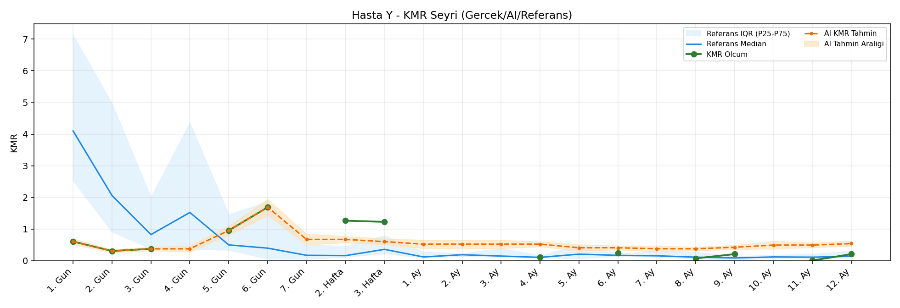
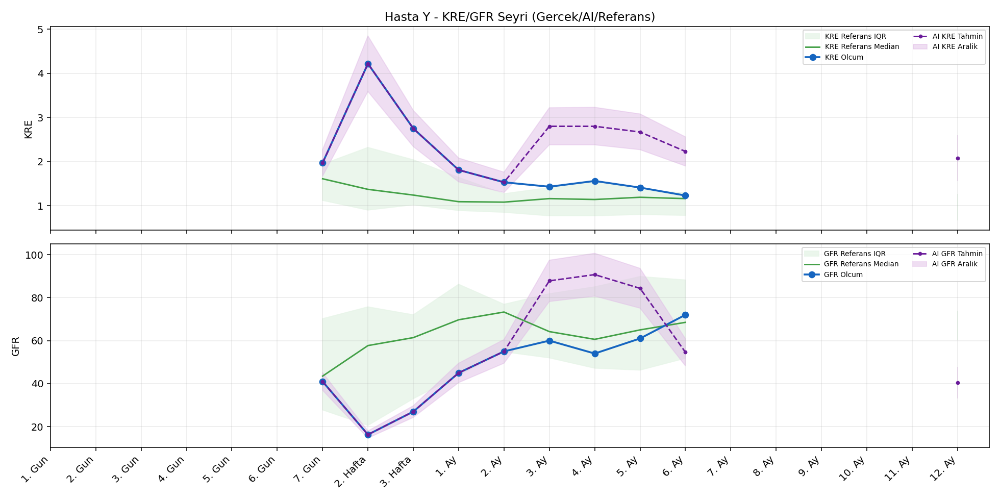

# Hasta Y

[Ana rapora don](../../Hasta_Raporları_Detay.md)

## Hasta Ozeti

| Alan | Deger |
|---|---|
| Yas | 41 |
| Cinsiyet | MALE |
| BMI | 27.5 |
| Vital Status | LIVING |
| Risk Skoru (Son) | 35.9 |
| Risk Seviyesi | Dikkat |
| Anomali Durumu | Yok |
| Son KMR | 0.2418 (6. Ay) |
| Son KRE | 1.23 (6. Ay) |
| Son GFR | 72.0 (6. Ay) |

## Grafikler

## IQR ve Median Ozeti

| Metrik | Hasta (Median / IQR) | Referans (Median / IQR) | Son Olcum Zamani |
|---|---|---|---|
| KMR | 0.605 / 0.921 | 0.142 / 0.866 | 6. Ay |
| KRE | 1.560 / 0.540 | 1.170 / 0.770 | 6. Ay |
| GFR | 54.000 / 19.000 | 59.800 / 29.600 | 6. Ay |

## AI Performans (Hasta Bazli)

| Metrik | Eval Nokta | MAE | RMSE | MAPE | Aralik Kapsama | Son Hata |
|---|---:|---:|---:|---:|---:|---:|
| KMR | 4 | 0.5219 | 0.5254 | %188.84 | %0.0 | 0.4213 |
| KRE | 4 | 0.527 | 0.554 | %38.79 | %0.0 | 0.800 |
| GFR | 4 | 17.42 | 24.59 | %26.39 | %50.0 | -46.80 |

## Zaman Serisi Detay Tablosu

| Zaman | KMR | AI KMR | Durum | KRE | AI KRE | Durum | GFR | AI GFR | Durum | Risk | Seviye | Anomali |
|---|---:|---:|---|---:|---:|---|---:|---:|---|---:|---|---|
| 1. Gun | 0.6049 | 0.6049 | Olcum Kopyasi | - | - | Uygulanmaz | - | - | Uygulanmaz | 5.1 | Normal | - |
| 2. Gun | 0.3053 | 0.3053 | Olcum Kopyasi | - | - | Uygulanmaz | - | - | Uygulanmaz | 8.2 | Normal | - |
| 3. Gun | 0.3741 | 0.3741 | Olcum Kopyasi | - | - | Uygulanmaz | - | - | Uygulanmaz | 14.2 | Normal | - |
| 4. Gun | - | 0.3741 | Ongoru | - | - | Uygulanmaz | - | - | Uygulanmaz | 0.0 | Normal | - |
| 5. Gun | 0.9545 | 0.9545 | Olcum Kopyasi | - | - | Uygulanmaz | - | - | Uygulanmaz | 19.4 | Normal | - |
| 6. Gun | 1.6870 | 1.6870 | Olcum Kopyasi | - | - | Uygulanmaz | - | - | Uygulanmaz | 33.0 | Dikkat | - |
| 7. Gun | - | 0.7051 | Ongoru | 1.97 | 1.97 | Olcum Kopyasi | 41.0 | 41.0 | Olcum Kopyasi | 35.9 | Dikkat | - |
| 2. Hafta | 1.2636 | 0.7051 | Model | 4.22 | 4.22 | Olcum Kopyasi | 16.3 | 16.3 | Olcum Kopyasi | 34.7 | Dikkat | - |
| 3. Hafta | 1.2259 | 0.6459 | Model | 2.75 | 2.75 | Olcum Kopyasi | 27.0 | 27.0 | Olcum Kopyasi | 30.3 | Dikkat | - |
| 1. Ay | - | 0.6356 | Ongoru | 1.81 | 1.81 | Olcum Kopyasi | 45.0 | 45.0 | Olcum Kopyasi | 27.5 | Normal | - |
| 2. Ay | - | 0.6356 | Ongoru | 1.53 | 1.53 | Olcum Kopyasi | 55.0 | 55.0 | Olcum Kopyasi | 22.9 | Normal | - |
| 3. Ay | - | 0.6356 | Ongoru | 1.43 | 1.90 | Model | 60.0 | 65.1 | Model | 21.8 | Normal | - |
| 4. Ay | 0.1078 | 0.6356 | Model | 1.56 | 1.90 | Model | 54.0 | 67.6 | Model | 19.8 | Normal | - |
| 5. Ay | - | 0.6631 | Ongoru | 1.41 | 1.91 | Model | 61.0 | 56.8 | Model | 22.3 | Normal | - |
| 6. Ay | 0.2418 | 0.6631 | Model | 1.23 | 2.03 | Model | 72.0 | 25.2 | Model | 20.6 | Normal | - |
| 7. Ay | - | 0.8201 | Ongoru | - | - | Uygulanmaz | - | - | Uygulanmaz | 0.0 | Normal | - |
| 8. Ay | - | 0.8201 | Ongoru | - | - | Uygulanmaz | - | - | Uygulanmaz | 0.0 | Normal | - |
| 9. Ay | - | 0.8201 | Ongoru | - | - | Uygulanmaz | - | - | Uygulanmaz | 0.0 | Normal | - |
| 10. Ay | - | 0.8201 | Ongoru | - | - | Uygulanmaz | - | - | Uygulanmaz | 0.0 | Normal | - |
| 11. Ay | - | 0.8201 | Ongoru | - | - | Uygulanmaz | - | - | Uygulanmaz | 0.0 | Normal | - |
| 12. Ay | - | 0.8201 | Ongoru | - | 2.15 | Ongoru | - | 19.5 | Ongoru | 0.0 | Normal | - |

> Not: Bu dosya `python3 backend/run_all.py` ile otomatik uretilir.
