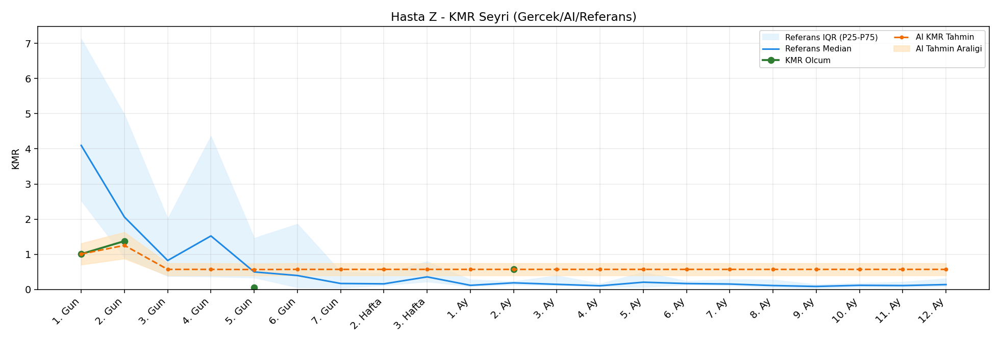
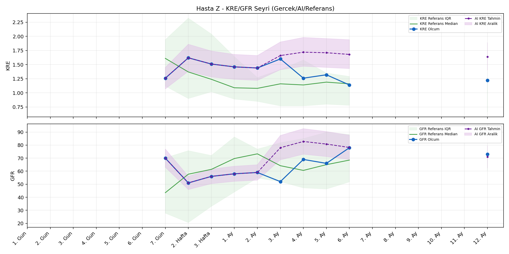
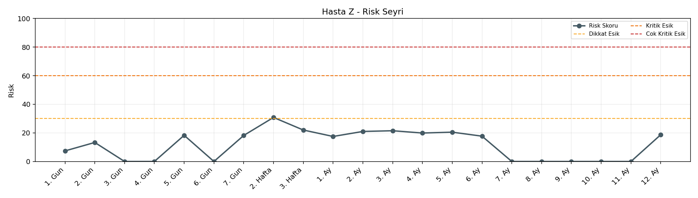

# Hasta Z

[Ana rapora don](../../Hasta_Raporları_Detay.md)

## Hasta Ozeti

| Alan | Deger |
|---|---|
| Yas | 41 |
| Cinsiyet | MALE |
| BMI | 20.8 |
| Vital Status | LIVING |
| Risk Skoru (Son) | 30.8 |
| Risk Seviyesi | Dikkat |
| Anomali Durumu | Yok |
| Son KMR | 0.5744 (2. Ay) |
| Son KRE | 1.22 (12. Ay) |
| Son GFR | 73.0 (12. Ay) |

## Grafikler

## IQR ve Median Ozeti

| Metrik | Hasta (Median / IQR) | Referans (Median / IQR) | Son Olcum Zamani |
|---|---|---|---|
| KMR | 0.791 / 0.656 | 0.364 / 0.137 | 2. Ay |
| KRE | 1.380 / 0.238 | 1.020 / 0.560 | 12. Ay |
| GFR | 62.500 / 13.250 | 64.000 / 15.000 | 12. Ay |

## AI Performans (Hasta Bazli)

| Metrik | Eval Nokta | MAE | RMSE | MAPE | Aralik Kapsama | Son Hata |
|---|---:|---:|---:|---:|---:|---:|
| KMR | 0 | - | - | - | %0.0 | - |
| KRE | 5 | 0.218 | 0.231 | %17.50 | %40.0 | 0.240 |
| GFR | 5 | 20.44 | 23.36 | %33.00 | %40.0 | 5.20 |

## Zaman Serisi Detay Tablosu

| Zaman | KMR | AI KMR | Durum | KRE | AI KRE | Durum | GFR | AI GFR | Durum | Risk | Seviye | Anomali |
|---|---:|---:|---|---:|---:|---|---:|---:|---|---:|---|---|
| 1. Gun | 1.0076 | 1.0076 | EWMA Yedek | - | - | Uygulanmaz | - | - | Uygulanmaz | 7.4 | Normal | - |
| 2. Gun | 1.3757 | 1.2530 | EWMA Yedek | - | - | Uygulanmaz | - | - | Uygulanmaz | 13.3 | Normal | - |
| 3. Gun | - | 0.5706 | Yedek Ongoru | - | - | Uygulanmaz | - | - | Uygulanmaz | 0.0 | Normal | - |
| 4. Gun | - | 0.5706 | Yedek Ongoru | - | - | Uygulanmaz | - | - | Uygulanmaz | 0.0 | Normal | - |
| 5. Gun | 0.0512 | 0.5662 | EWMA Yedek | - | - | Uygulanmaz | - | - | Uygulanmaz | 18.3 | Normal | - |
| 6. Gun | - | 0.5706 | Yedek Ongoru | - | - | Uygulanmaz | - | - | Uygulanmaz | 0.0 | Normal | - |
| 7. Gun | - | 0.5706 | Yedek Ongoru | 1.26 | 1.26 | Olcum Kopyasi | 70.0 | 70.0 | Olcum Kopyasi | 18.2 | Normal | - |
| 2. Hafta | - | 0.5706 | Yedek Ongoru | 1.62 | 1.62 | Olcum Kopyasi | 51.0 | 51.0 | Olcum Kopyasi | 30.8 | Dikkat | - |
| 3. Hafta | - | 0.5706 | Yedek Ongoru | 1.51 | 1.51 | Olcum Kopyasi | 56.0 | 56.0 | Olcum Kopyasi | 22.0 | Normal | - |
| 1. Ay | - | 0.5706 | Yedek Ongoru | 1.46 | 1.46 | Olcum Kopyasi | 58.0 | 58.0 | Olcum Kopyasi | 17.5 | Normal | - |
| 2. Ay | 0.5744 | 0.5706 | EWMA Yedek | 1.44 | 1.44 | Olcum Kopyasi | 59.0 | 59.0 | Olcum Kopyasi | 21.0 | Normal | - |
| 3. Ay | - | 0.5706 | Yedek Ongoru | 1.60 | 1.49 | Model | 52.0 | 88.5 | Model | 21.5 | Normal | - |
| 4. Ay | - | 0.5706 | Yedek Ongoru | 1.26 | 1.49 | Model | 69.0 | 93.6 | Model | 19.9 | Normal | - |
| 5. Ay | - | 0.5706 | Yedek Ongoru | 1.32 | 1.49 | Model | 66.0 | 91.7 | Model | 20.5 | Normal | - |
| 6. Ay | - | 0.5706 | Yedek Ongoru | 1.14 | 1.48 | Model | 78.0 | 88.2 | Model | 17.7 | Normal | - |
| 7. Ay | - | 0.5706 | Yedek Ongoru | - | - | Uygulanmaz | - | - | Uygulanmaz | 0.0 | Normal | - |
| 8. Ay | - | 0.5706 | Yedek Ongoru | - | - | Uygulanmaz | - | - | Uygulanmaz | 0.0 | Normal | - |
| 9. Ay | - | 0.5706 | Yedek Ongoru | - | - | Uygulanmaz | - | - | Uygulanmaz | 0.0 | Normal | - |
| 10. Ay | - | 0.5706 | Yedek Ongoru | - | - | Uygulanmaz | - | - | Uygulanmaz | 0.0 | Normal | - |
| 11. Ay | - | 0.5706 | Yedek Ongoru | - | - | Uygulanmaz | - | - | Uygulanmaz | 0.0 | Normal | - |
| 12. Ay | - | 0.5706 | Yedek Ongoru | 1.22 | 1.46 | Model | 73.0 | 78.2 | Model | 18.7 | Normal | - |

> Not: Bu dosya `python3 backend/run_all.py` ile otomatik uretilir.
