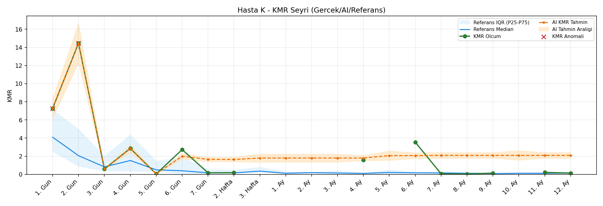
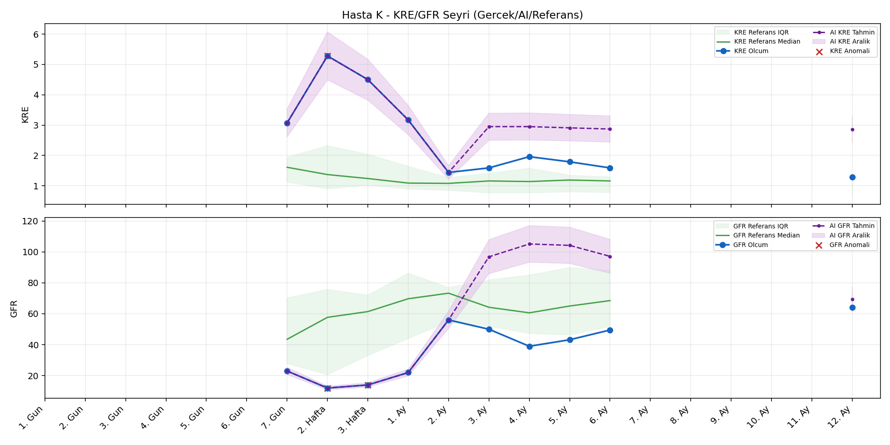
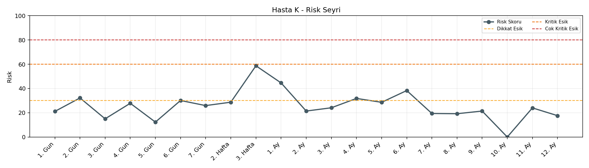
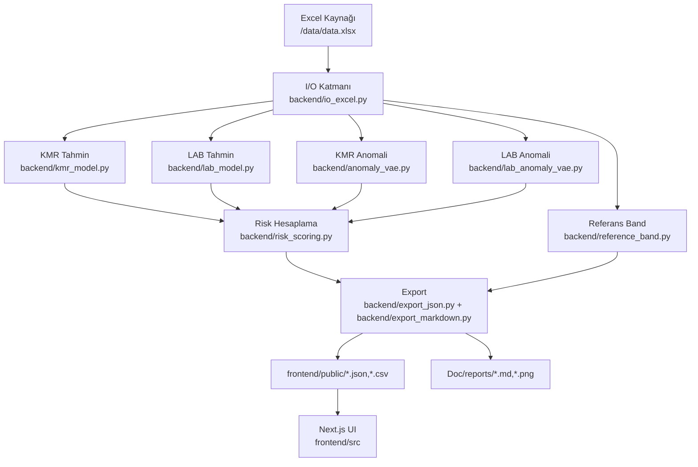
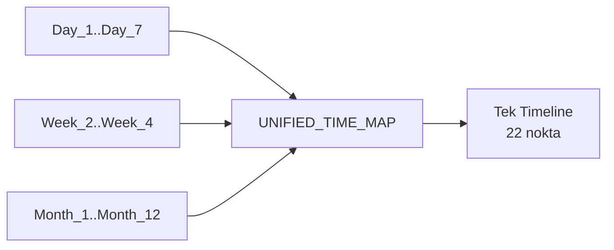
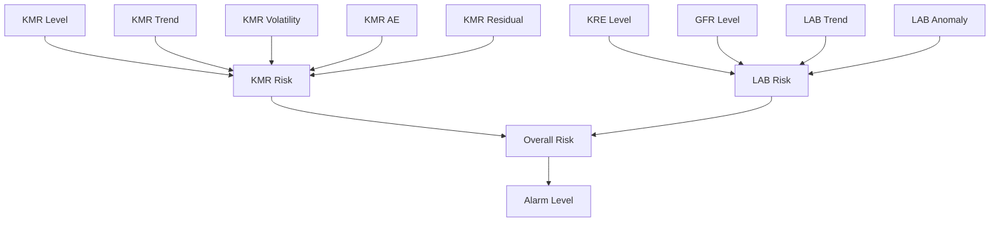
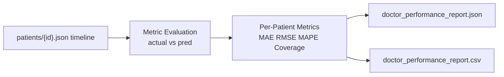
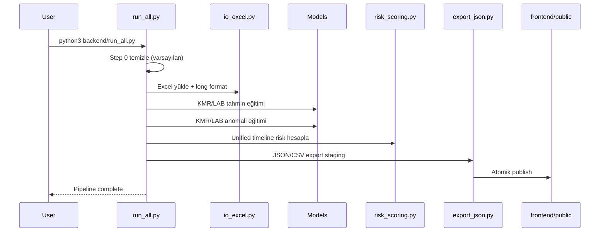

# NISTH - Non-invasive Screening of Transplantation Health

NISTH, transplant sonrası hastaların KMR/KRE/GFR ölçümlerini tek bir teknik boru hattında işleyip klinik karar desteği için risk, anomali, tahmin ve kohort karşılaştırması üreten bir sistemdir.


## Görsel Önizleme

> Aşağıdaki görseller `python3 backend/run_all.py` sonrası dinamik üretilen rapor varlıklarından alınır.

### Örnek Hasta Grafikleri (K)







## Hızlı Erişim

| Konu | Link |
|---|---|
| Dinamik hasta raporları (index) | `Doc/Hasta_Raporları_Detay.md` |
| Pipeline çalıştırma | [Pipeline Çalıştırma](#pipeline-çalıştırma-run_allpy) |
| Tam doğrulama | [Tam Doğrulama](#tam-doğrulama-full_system_checkpy) |
| Çıktı sözleşmesi | [Çıktı Dosyaları ve Veri Sözleşmesi](#çıktı-dosyaları-ve-veri-sözleşmesi) |
| Risk skorlama detayları | [Risk Skorlama Yapısı](#risk-skorlama-yapısı) |

## İçindekiler

1. Sistem Özeti
2. Mimari ve Bileşenler
3. Veri Girişi ve Dönüşüm Kuralları
4. Zaman Eksenleri ve Birleşik Timeline
5. Tahmin Modelleri
6. Anomali Modelleri
7. Risk Skorlama Yapısı
8. Improved Cohort Mantığı
9. Çıktı Dosyaları ve Veri Sözleşmesi
10. Doktor Paneli Performans Raporu
11. Pipeline Çalıştırma (`run_all.py`)
12. Tam Doğrulama (`full_system_check.py`)
13. Frontend Entegrasyonu
14. Operasyonel Notlar ve Limitasyonlar
15. Hızlı Komut Referansı
16. Ek Dokümanlar

## Sistem Özeti

NISTH aşağıdaki sorulara cevap verir:

- Hastanın her zaman noktasındaki toplam klinik riski nedir?
- Bu risk KMR kaynaklı mı LAB kaynaklı mı?
- Ölçüm dışı zaman noktalarında risk nasıl ele alınmalı?
- Anomali var mı, hangi metrikte var?
- Hasta trendi iyileşmiş kohort davranışına ne kadar yakın?
- Modelin hasta bazlı tahmin performansı nedir?

### Temel Çıktılar

- Hasta detay timeline JSON dosyaları
- Dashboard özet dosyaları
- Referans bant / kohort analizi
- Doktor paneli hasta bazlı performans raporu
- Dinamik markdown hasta raporları (`Doc/Hasta_Raporları_Detay.md`)

## Mimari ve Bileşenler



### Backend Modül Haritası

| Modül | Sorumluluk |
|---|---|
| `backend/io_excel.py` | Excel okuma, kolon normalize etme, long format üretimi, improved cohort etiketleme |
| `backend/time_mapping.py` | KMR/LAB/unified timeline sözleşmesi |
| `backend/kmr_model.py` | KMR hasta bazlı tahmin |
| `backend/lab_model.py` | KRE/GFR tahmini (tekli ve çoklu çıktı) |
| `backend/anomaly_vae.py` | KMR anomali skorları |
| `backend/lab_anomaly_vae.py` | KRE/GFR anomali skorları |
| `backend/risk_scoring.py` | Bileşen riskleri + birleşik risk + alarm seviyesi |
| `backend/reference_band.py` | Improved cohort referans bantları ve trend çizgileri |
| `backend/export_json.py` | Frontend için JSON/CSV export sözleşmeleri |
| `backend/export_markdown.py` | Dinamik markdown raporları + PNG grafik üretimi |
| `backend/run_all.py` | Uçtan uca pipeline orkestrasyonu |
| `backend/full_system_check.py` | Uçtan uca veri + şema + frontend build doğrulaması |

## Veri Girişi ve Dönüşüm Kuralları

### Birincil Kaynak

- `data/data.xlsx`

### Alan Grupları

| Grup | Alanlar |
|---|---|
| Hasta meta | `patient_code`, `age`, `BMI`, `vital_status`, `blood_group`, `gender` |
| KMR | `Day_1..Day_7`, `Week_2..Week_4`, `Month_2..Month_12` |
| LAB | `*_KRE`, `*_GFR` çiftleri (`Day_7`, `Week_2`, `Week_3`, `Month_1..Month_6`, `Month_12`) |

### Dönüşüm Kuralları

- `io_excel.load_excel` kolon adlarında boşluk/format sorunlarını normalize eder.
- KMR `wide -> long` dönüşümü çıktısı:
  - `patient_code`, `time_key`, `time_order`, `pseudo_time_days`, `kmr`
- LAB `wide -> long` dönüşümü çıktısı:
  - `patient_code`, `time_key`, `time_order`, `pseudo_time_days`, `kre`, `gfr`
- Sadece mevcut (non-null) ölçüm satırları long yapıya eklenir.

## Zaman Eksenleri ve Birleşik Timeline

Kaynak: `backend/time_mapping.py`

| Harita | Nokta Sayısı | Kullanım |
|---|---:|---|
| `KMR_TIME_MAP` | 21 | KMR eğitim ve görselleştirme sırası |
| `LAB_TIME_MAP` | 10 | KRE/GFR eğitim sırası |
| `UNIFIED_TIME_MAP` | 22 | Risk, timeline birleşimi, UI senkronizasyonu |

`UNIFIED_TIME_MAP` alanları:

- `order`: grafik ve model sırası
- `pseudo_days`: gün bazlı analitik zaman
- `has_kmr`: bu noktada KMR beklenir mi
- `has_lab`: bu noktada KRE/GFR beklenir mi



Bu yaklaşım sayesinde:

- tüm paneller aynı zaman düzenini kullanır,
- LAB ve KMR ölçüm boşlukları açıkça ayrıştırılır,
- tahmin durumu (`*_pred_status`) anlaşılır hale gelir.

## Tahmin Modelleri

### 5.1 KMR Tahmini (`backend/kmr_model.py`)

Model davranışı:

- TensorFlow varsa LSTM/GRU tabanlı hasta modelleri,
- veri azsa fallback tahmini,
- unified grid üzerinde geçmiş + ileri tahmin üretimi.

Feature engineering (özet):

- `delta_from_baseline`
- `ratio_from_baseline`
- EWMA
- rolling CV
- kısa dönem eğim

Stabilite kuralları:

- fizyolojik sınır clamp (`0..100`)
- interval düzeni (`pred_lo <= pred <= pred_hi`)

Üretilen alanlar:

- `kmr_pred`, `kmr_pred_lo`, `kmr_pred_hi`, `residual`

### 5.2 LAB Tahmini (`backend/lab_model.py`)

Model davranışı:

- KRE ve GFR için tekli veya çoklu-output model,
- unified LAB timeline üzerinde tahmin,
- GFR için hasta-içi bias kalibrasyonu.

Stabilite kuralları:

- KRE clamp: `0..15`
- GFR clamp: `0..180`
- interval düzeni garanti

Üretilen alanlar:

- `kre_pred`, `kre_pred_lo`, `kre_pred_hi`
- `gfr_pred`, `gfr_pred_lo`, `gfr_pred_hi`

## Anomali Modelleri

### 6.1 KMR Anomali (`backend/anomaly_vae.py`)

- VAE/autoencoder yaklaşımıyla reconstruction error tabanlı skor
- Eğitim başarısızsa basit eşik/z-score fallback

Üretilen alanlar:

- `kmr_anomaly_score`
- `kmr_anomaly_flag`

### 6.2 LAB Anomali (`backend/lab_anomaly_vae.py`)

- KRE ve GFR için ayrı model/fallback
- Uygun olduğunda multi-output öğrenme

Üretilen alanlar:

- `kre_anomaly_score`, `kre_anomaly_flag`
- `gfr_anomaly_score`, `gfr_anomaly_flag`

## Risk Skorlama Yapısı

Kaynaklar:

- `backend/risk_scoring.py`
- `backend/config.py`



### 7.1 KMR Seviye Kuralı

Klinik eşikler:

- `<=0.5`: iyi
- `0.5-2`: dikkat
- `2-5`: kritik
- `>5`: çok kritik

Erken faz ağırlığı:

- `pseudo_days <= 2`: `*0.55`
- `3..6`: `*0.80`
- `>=7`: `*1.00`

### 7.2 KMR Risk Formülü

```text
kmr_risk =
  0.35*kmr_level +
  0.25*kmr_trend +
  0.10*kmr_volatility +
  0.15*kmr_ae +
  0.15*kmr_residual
```

### 7.3 LAB Risk Kuralları

- KRE düşükse iyi, GFR yüksekse iyi
- Trend:
  - KRE düşüşü olumlu
  - GFR artışı olumlu
- LAB anomaly katkısı eklenir

Ağırlıklar:

- `lab_level_weight = 0.6`
- `lab_trend_weight = 0.4`
- iç anomaly katkısı: `0.3`
- son çıktı ölçeği: `*0.9`

### 7.4 Genel Risk ve Alarm

```text
overall_risk = 0.65*kmr_risk + 0.35*min(lab_risk, kmr_risk+20)
```

Alarm eşikleri:

| Aralık | Seviye |
|---|---|
| `0-29.9` | `Normal` |
| `30-59.9` | `Dikkat` |
| `60-79.9` | `Kritik` |
| `80-100` | `Çok Kritik` |

### 7.5 Ölçüm Boşluğu Politikası

Aynı zaman noktasında `kmr`, `kre`, `gfr` hepsi boş ise:

- `overall_risk = 0`
- trend carry-forward uygulanmaz

Bu karar, ölçüm olmayan noktalarda yanlış alarm birikimini engeller.

### 7.6 Tahmin Durum Kodları

Timeline, her metrik için aşağıdaki status alanlarını taşır:

- `kmr_pred_status`
- `kre_pred_status`
- `gfr_pred_status`

| Status | Anlam |
|---|---|
| `ok` | Model tahmini geçerli |
| `forecast` | İleri dönem öngörü |
| `warmup_copy` | Erken dönem gerçek ölçüm kopyası |
| `warmup_bootstrap` | Warmup tahmini |
| `fallback_ewma` | EWMA fallback |
| `fallback_forecast` | Fallback ileri tahmin |
| `insufficient_data` | Veri yetersiz |
| `missing_prediction` | Tahmin üretilemedi |
| `timepoint_not_applicable` | O metrik için zaman noktası uygulanmaz |

Bu sayede UI, boş tahmini “neden boş” olarak açıklayabilir.

## Improved Cohort Mantığı

Kaynak: `backend/io_excel.py::calculate_improved_proxy`

Kural seti:

1. Aday hasta: `Month_9..Month_12` içinde en az bir KMR değeri
2. Klinik iyileşme:
   - KMR: `last < 0.5` veya ilk değere göre güçlü düşüş
   - KRE: `last < 1.2` veya kötüleşmeme
   - GFR: `last >= 90` veya kötüleşmeme
3. Katı kohort çok küçükse fallback: aday kohort

Bu kohort aşağıdaki üretimlerde kullanılır:

- referans bant
- kohort trajectory
- klinik benchmark görselleri

## Çıktı Dosyaları ve Veri Sözleşmesi

### Pipeline çıktıları (`frontend/public`)

| Dosya | İçerik |
|---|---|
| `patients/{patient_code}.json` | hasta timeline + meta + last status |
| `patient_features.json` | liste ekranı için özet feature set |
| `data_summary.json` | üst KPI özetleri |
| `reference_band.json` | improved cohort median/IQR bantları |
| `cohort_trajectory.json` | KMR kohort eğrisi |
| `cohort_trajectory_lab.json` | KRE/GFR kohort eğrisi |
| `channel_overview.json` | metrik kapsama/ölçüm sayıları |
| `doctor_performance_report.json` | hasta bazlı model performansı |
| `doctor_performance_report.csv` | doktor paneli tablosal export |

### Pipeline sonrası dokümantasyon çıktıları (`Doc`)

| Dosya | İçerik |
|---|---|
| `Hasta_Raporları_Detay.md` | dinamik ana index |
| `reports/patients/{patient_code}.md` | hasta bazlı detay markdown raporları |
| `reports/assets/*.png` | otomatik üretilen grafikler |

### 9.1 Hasta Timeline JSON (özet sözleşme)

```json
{
  "meta": {
    "patient_code": "AB",
    "improved_proxy": true
  },
  "timeline": [
    {
      "time_key": "Day_7",
      "kmr": 0.81,
      "kre": 1.42,
      "gfr": 74.0,
      "kmr_pred": 0.88,
      "kmr_pred_status": "ok",
      "kre_pred_status": "ok",
      "gfr_pred_status": "ok",
      "kmr_anomaly_flag": false,
      "risk_score": 31.4,
      "risk_level": "Dikkat"
    }
  ],
  "last_status": {
    "kmr_last": 0.49,
    "risk_last": 24.3,
    "risk_level_last": "Normal"
  }
}
```

### 9.2 Patient Features JSON (özet)

- Liste ekranı için optimize hafif hasta kaydı
- Son gerçek ölçüm değerleri + son ölçüm zamanları
- Anomali rozetleri + risk seviyeleri

### 9.3 Data Summary JSON (özet)

- Toplam hasta sayısı
- Improved cohort sayısı
- Anomalili hasta sayısı
- Risk dağılımı
- Ortalama skorlar

## Doktor Paneli Performans Raporu

Dosyalar:

- `frontend/public/doctor_performance_report.json`
- `frontend/public/doctor_performance_report.csv`

Amaç:

- modelin hasta bazlı tahmin kalitesini ölçmek
- hangi metrikte sapma olduğunu hızlı görmek
- klinik review toplantılarında doğrudan kullanılabilir performans dökümü sağlamak

Alanlar (hasta bazlı):

- `n_actual_points`, `n_pred_points`, `n_eval_points`
- `mae`, `rmse`, `mape_percent`, `bias`
- `n_interval_points`, `interval_coverage`
- `last_actual`, `last_pred`, `last_error`



## Pipeline Çalıştırma (`run_all.py`)

`backend/run_all.py` varsayılan olarak:

- eski üretilmiş çıktıları temizler
- tüm eğitimi sıfırdan yapar
- atomik publish uygular
- dinamik markdown raporları ve PNG grafikleri tekrar üretir

```bash
python3 backend/run_all.py
```

Temizliği atlamak için:

```bash
python3 backend/run_all.py --skip-clean
```

### Pipeline Adımları



## Tam Doğrulama (`full_system_check.py`)

```bash
python3 backend/full_system_check.py
```

Kontrol kapsamı:

- Excel -> JSON KMR/KRE/GFR birebir değer kontrolü
- JSON şema ve tutarlılık
- risk/aralık/flag doğrulaması
- doktor raporu dosya + şema + hasta sayısı kontrolü
- dinamik markdown rapor dosyalarının bütünlüğü
- frontend lint + production build

Bu komut release öncesi kalite kapısıdır.

## Frontend Entegrasyonu

Ana data hook:

- `frontend/src/hooks/useKimerizmData.ts`

Ana sayfalar:

| Route | Açıklama |
|---|---|
| `/` | Dashboard |
| `/patients` | Hasta listesi |
| `/patients/[id]` | Hasta detay |
| `/reports` | Rapor indirme ekranı |

Rapor sayfası:

- klasik hasta CSV/PDF
- doktor performans CSV/JSON indirme

## Operasyonel Notlar ve Limitasyonlar

- Sistem batch tabanlıdır, gerçek zamanlı API sunmaz.
- TensorFlow yoksa fallback devreye girer; kalite etkilenebilir.
- Klinik kararlar için tek başına kullanılmamalıdır.
- Girdi kalitesi (`data/data.xlsx`) doğrudan çıktı kalitesini etkiler.

## Hızlı Komut Referansı

```bash
# bağımlılıklar
pip install -r requirements.txt
cd frontend && npm install && cd ..

# tam pipeline (clean + train + export)
python3 backend/run_all.py

# tam doğrulama
python3 backend/full_system_check.py

# sadece mevcut çıktıları doğrula (pipeline çalıştırmadan)
python3 backend/full_system_check.py --skip-pipeline

# frontend geliştirme
cd frontend && npm run dev

# frontend kalite kontrol
cd frontend && npm run lint && npm run build:next
```

## Ek Dokümanlar

- Sistem raporu: `Doc/SISTEM_RAPORU.md`
- Mimari: `Doc/SISTEM_MIMARISI.md`
- Grafik açıklamaları: `Doc/GRAFIK_ACIKLAMA_DOKÜMANTASYON.md`
- Gelişmiş sistem notları: `Doc/GELISMIS_KIMERIZM_SISTEMI_v2.md`
- Kurulum: `Doc/kurulum.md`, `frontend/kurulum.md`

## Klinik Uyarı

> Bu sistem karar destek amaçlıdır. Nihai klinik kararlar uzman hekim değerlendirmesi ile alınmalıdır.
